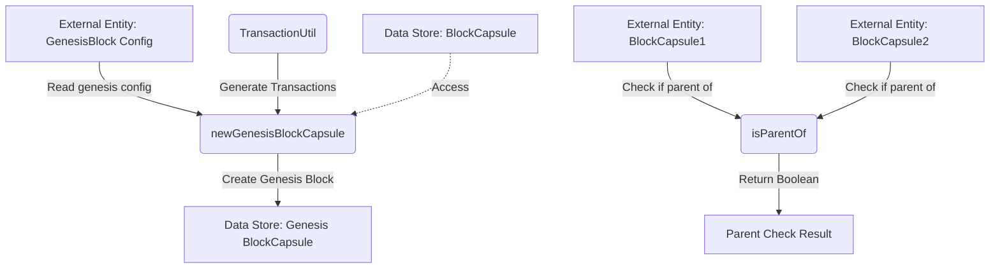

## Module: BlockUtil.java
**模块名称**: BlockUtil.java

**主要目标**: BlockUtil.java 的主要目的是提供处理区块链中区块的工具方法，特别是在创建创世区块和验证区块链结构时。

**关键函数**:
- `newGenesisBlockCapsule()`: 创建创世区块。该方法利用配置参数（如初始交易列表、时间戳、父哈希值等）生成创世区块。
- `isParentOf(BlockCapsule blockCapsule1, BlockCapsule blockCapsule2)`: 判断一个区块是否是另一个区块的父区块，通过比较区块ID和父哈希值来实现。

**关键变量**:
- `transactionList`: 创世区块中的交易列表。
- `timestamp`: 区块的时间戳。
- `parentHash`: 父区块的哈希值。
- `number`: 区块编号。

**相互依赖**:
BlockUtil 模块与系统的其他组件（如 TransactionUtil、BlockCapsule 等）紧密相连，共同支持区块链的基本功能。

**核心与辅助操作**:
- 核心操作包括创建创世区块和验证区块链结构的正确性。
- 辅助操作可能包括设置区块的各种属性，如默克尔树根或见证人信息。

**操作序列**:
在创建创世区块时，首先根据配置参数生成交易列表，然后使用这些参数（包括时间戳、父哈希值、区块编号和交易列表）创建 BlockCapsule 实例，并设置其默克尔树根和见证人信息。

**性能方面**:
性能考虑可能包括如何高效地生成和验证区块，尤其是在处理大量交易时。

**可重用性**:
BlockUtil 中的方法设计得通用且灵活，可以在不同的区块链项目中重用，尤其是那些基于java-tron框架的项目。

**使用方式**:
BlockUtil 模块的方法可以在需要创建创世区块或验证区块链结构时调用，是区块链初始化和维护过程中不可或缺的一部分。

**假设**:
- 假设所有传入的参数（如时间戳、父哈希值等）都是有效和正确的。
- 假设系统配置（例如，创世区块的参数）已经提前正确设置。

通过这些方法和变量，BlockUtil 模块为区块链的初始化和日常运维提供了基础支持。
## Flow Diagram [via mermaid]

