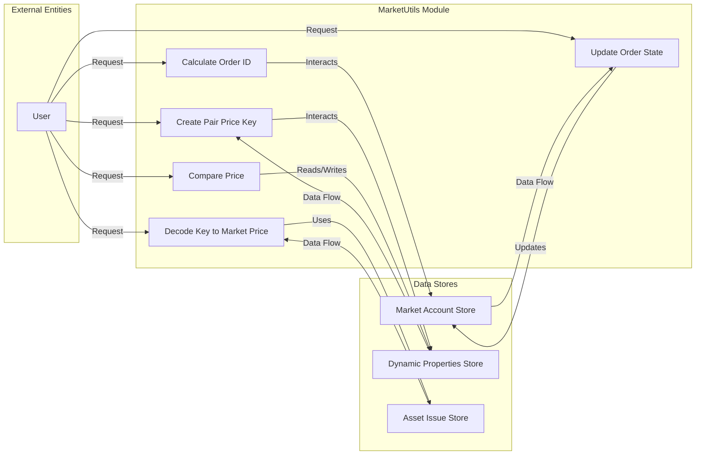

## Module: MarketUtils.java
基于提供的代码模块，以下是用中文进行的全面分析：

- **模块名称**：MarketUtils.java
- **主要目标**：该模块的目的是提供市场订单及其价格的一系列工具方法，用于处理订单ID的生成、价格比较、订单状态更新等。
- **关键函数**：
  - `calculateOrderId`：生成订单ID。
  - `findGCD`和`calGCD`：计算两个数字的最大公约数，用于价格键的生成。
  - `createPairPriceKey`和`createPairPriceKeyNoGCD`：创建交易对价格键。
  - `decodeKeyToMarketPrice`和`decodeKeyToMarketPair`：从键中解码出市场价格和市场交易对。
  - `comparePrice`：比较两个价格。
  - `updateOrderState`：更新订单状态。
  - `returnSellTokenRemain`：退回未售出的卖方代币。
- **关键变量**：
  - `TOKEN_ID_LENGTH`：代币ID的长度。
- **相互依赖**：
  - 与`AccountCapsule`、`MarketOrderCapsule`、`MarketPriceCapsule`等类相互作用，用于处理账户、订单和价格的数据。
  - 依赖于`DynamicPropertiesStore`、`AssetIssueStore`、`MarketAccountStore`等存储类，用于数据的存储和检索。
- **核心 vs. 辅助操作**：
  - 核心操作包括订单ID的生成、价格的比较和订单状态的更新。
  - 辅助操作包括键的编解码、价格键的生成等。
- **操作序列**：无特定序列，每个方法根据需要独立调用。
- **性能方面**：部分方法如价格比较和订单ID生成在性能上需要注意，特别是涉及大数运算和数组复制的地方。
- **可重用性**：该模块提供的工具方法具有较高的可重用性，可以在处理不同市场订单和价格计算场景中广泛使用。
- **使用**：主要用于交易平台或区块链项目中，处理市场订单的生成、状态更新和价格比较等功能。
- **假设**：
  - 假设所有输入的代币ID和数量都是有效的。
  - 在进行价格比较和订单状态更新时，假设所有必要的参数都已正确提供。

请注意，这个分析基于代码本身的阅读理解，没有运行或测试代码的上下文。
## Flow Diagram [via mermaid]

