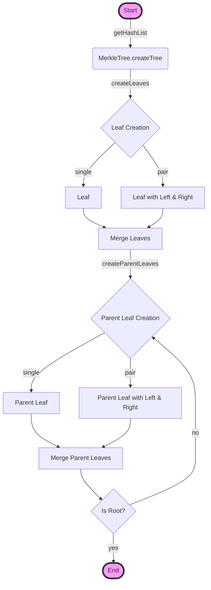

## Module: MerkleTree.java
基于所提供的代码模块，以下是用中文进行的综合分析：

- **模块名称**：MerkleTree.java

- **主要目标**：该模块的目的是实现一个默克尔树（Merkle Tree），用于有效地验证数据块链中的数据一致性和完整性。

- **关键函数**：
  - `getInstance()`：获取MerkleTree的单例实例。
  - `createTree(List<Sha256Hash> hashList)`：根据提供的哈希列表创建默克尔树。
  - `createLeaves(List<Sha256Hash> hashList)`：根据哈希列表创建叶节点。
  - `createParentLeaves(List<Leaf> leaves)`：创建父节点，直到形成根节点。
  - `createLeaf(Leaf left, Leaf right)` 和 `createLeaf(Sha256Hash hash)`：创建叶节点。
  - `computeHash(Sha256Hash leftHash, Sha256Hash rightHash)`：计算两个哈希值的组合哈希。

- **关键变量**：
  - `instance`：MerkleTree类的单例实例。
  - `hashList`：存储哈希值的列表。
  - `leaves`：存储叶节点的列表。
  - `root`：树的根节点。

- **相互依赖性**：此模块依赖于`org.tron.common.utils.Sha256Hash`来处理哈希操作，也依赖于`org.tron.common.parameter.CommonParameter`来决定使用的加密引擎。

- **核心与辅助操作**：构建和维护默克尔树的操作是核心操作，如`createTree`和`computeHash`。其他辅助操作包括管理单例实例和创建叶节点。

- **操作顺序**：首先，通过`createLeaves`方法从哈希列表创建叶节点。然后，不断通过`createParentLeaves`方法合并节点，直到形成单一的根节点。

- **性能方面**：在构建和验证默克尔树时，性能是一个重要考虑因素，特别是在处理大量数据时。通过使用流和并行处理可以优化性能。

- **可重用性**：此模块设计为可重用的，可以在需要有效验证数据完整性的任何地方使用。

- **使用**：在区块链和其他需要数据一致性验证的系统中使用，如在交易批量处理或数据完整性校验中。

- **假设**：
  - 假设所有输入的哈希值都是有效的。
  - 假设使用的加密引擎和哈希函数能够提供足够的安全性和性能。

这个分析提供了对MerkleTree模块的深入理解，包括其目的、关键功能、性能考虑因素以及如何在实际应用中使用。
## Flow Diagram [via mermaid]

