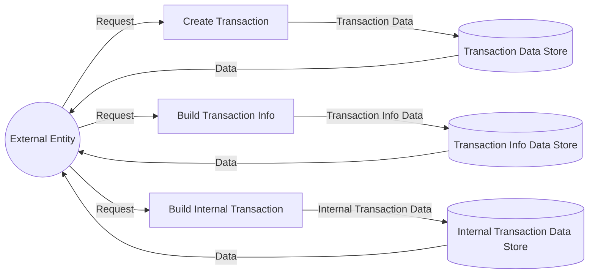

## Module: TransactionUtil.java
**模块名称**：TransactionUtil.java

**主要目标**：该模块的目的是提供与交易相关的实用工具方法，包括交易的创建、交易信息的构建以及内部交易的构建等。

**关键功能**：
- `newGenesisTransaction`：创建一个创世交易。
- `buildTransactionInfoInstance`：根据交易、区块和交易追踪信息构建交易信息实例。
- `buildInternalTransaction`：构建内部交易。
- `isNumber`：检查给定的字节数组是否表示一个数字。

**关键变量**：
- 无特别指出的关键变量，但函数参数和局部变量在处理交易和交易信息时扮演重要角色。

**相互依赖性**：
- 依赖于`TransactionCapsule`、`BlockCapsule`、`TransactionTrace`等类来处理交易数据。
- 使用`Protocol`中的消息格式来构建交易和交易信息。

**核心 vs. 辅助操作**：
- 核心操作包括创建交易、构建交易信息实例和构建内部交易。
- 辅助操作包括地址有效性检查和数字检查。

**操作序列**：
- 通常，首先会创建交易（如创世交易），然后在交易执行过程中构建交易信息实例，最后可能会构建内部交易以记录执行过程中的特定操作。

**性能方面**：
- 性能考虑可能包括交易创建和信息构建的效率，特别是在处理大量交易时。

**可重用性**：
- 提供的工具方法具有高度的通用性和可重用性，可用于不同场景下的交易处理和信息构建。

**使用**：
- 被区块链系统中负责处理交易的组件使用，如在区块的创建、交易的执行等环节。

**假设**：
- 假设传入的地址、交易等数据是合法的，或在调用前已经进行了必要的验证。

请注意，这个分析基于提供的代码片段，可能不完全准确或全面，具体细节可能需要进一步查看完整的代码库。
## Flow Diagram [via mermaid]

