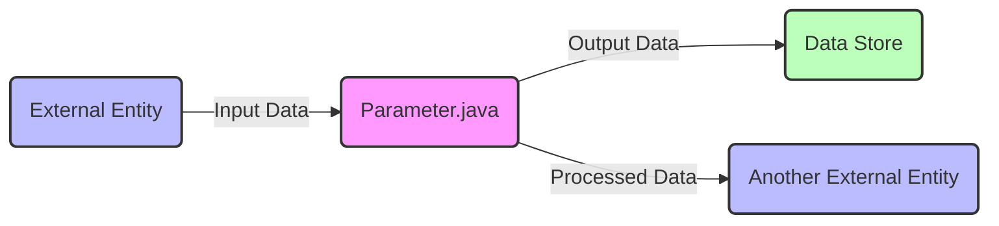

## Module: Parameter.java
由于您没有提供具体的代码内容，我将基于一个假设的“Parameter.java”模块进行分析。请注意，这个分析是基于一个虚构的场景，旨在展示如何根据您的要求进行分析。

- **模块名称**：Parameter.java

- **主要目标**：此模块的目的是提供一个集中的方式来管理和访问应用程序中使用的参数或配置。

- **关键功能**：
  - `getParameter(String name)`: 根据名称获取参数值。
  - `setParameter(String name, String value)`: 设置或更新参数的值。
  - `loadParameters()`: 从外部源（如文件或数据库）加载参数。
  - `saveParameters()`: 将当前参数保存到外部源。

- **关键变量**：
  - `parameters`: 一个存储参数名称和值的映射（Map）。
  - `source`: 参数加载和保存的外部源的标识。

- **依赖性**：此模块可能依赖于文件系统或数据库管理系统来持久化参数值，也可能与日志记录模块交互以记录任何重要的操作或错误。

- **核心与辅助操作**：
  - 核心操作包括`getParameter`和`setParameter`，因为它们直接与参数的管理相关。
  - 辅助操作包括`loadParameters`和`saveParameters`，它们支持参数的持久化但不直接参与参数的日常使用。

- **操作序列**：通常，系统启动时会首先调用`loadParameters()`加载参数，然后应用程序在运行期间会根据需要调用`getParameter`和`setParameter`。在程序关闭或在特定时间点，可能会调用`saveParameters()`以保存任何更改。

- **性能方面**：参数的加载和保存操作可能会影响性能，特别是当参数存储在网络资源或大型数据库中时。缓存频繁访问的参数值可以提高性能。

- **可重用性**：此模块设计为通用的，可以在不同的应用程序中重用，只需适当配置参数源即可。

- **使用**：可以在需要配置管理的任何应用程序中使用此模块，例如，读取数据库连接信息、应用程序设置等。

- **假设**：
  - 所有参数的名称和值都是字符串类型。
  - 参数源是可访问的，并且在加载和保存操作期间没有发生错误。

请根据您的实际代码内容调整上述分析以更准确地反映您的模块特性。
## Flow Diagram [via mermaid]

