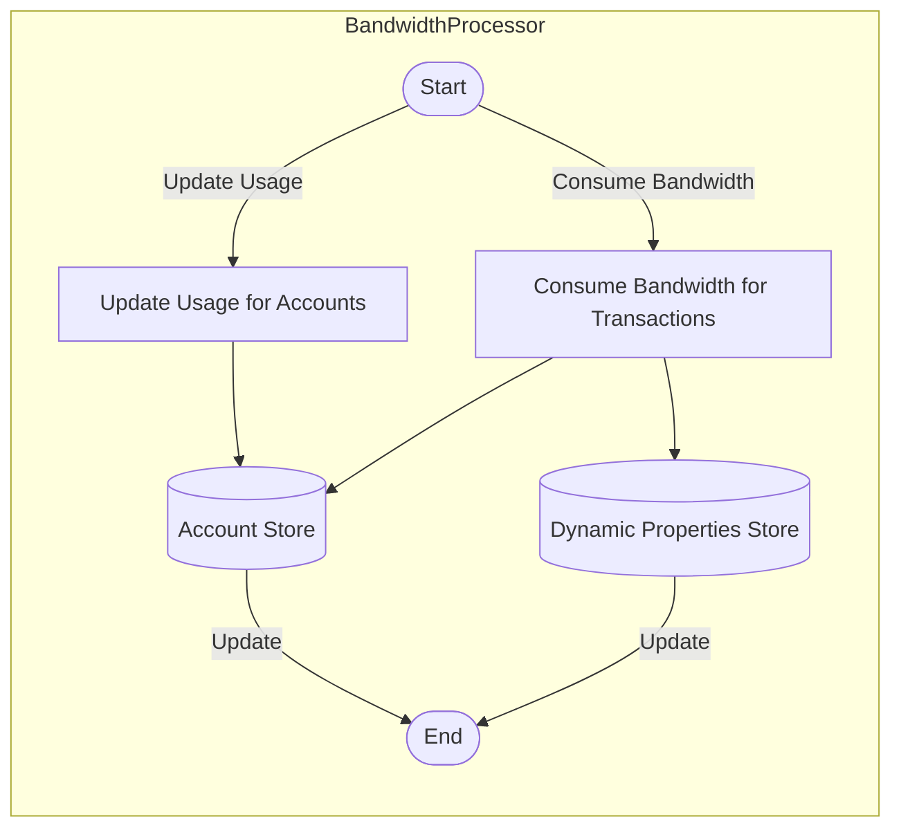

## Module: BandwidthProcessor.java
- **模块名称**：BandwidthProcessor.java

- **主要目标**：此模块的目的是处理与帐户带宽资源相关的操作，包括带宽的使用、更新和消耗。

- **关键功能**：
  - `updateUsageForDelegated`：为委托的帐户更新带宽使用情况。
  - `updateUsage`：为帐户更新带宽使用情况。
  - `consume`：在执行交易时消耗带宽。
  - `calculateGlobalNetLimit`：计算全局网络限制。
  - `useAccountNet`、`useFreeNet`、`useTransactionFee`：尝试使用帐户的不同类型的网络资源来消耗带宽。

- **关键变量**：
  - `chainBaseManager`：用于访问区块链基础数据和动态属性。
  - `dynamicPropertiesStore`：存储区块链的动态属性，如总网络限制和使用情况。

- **互依性**：
  - 与`ChainBaseManager`紧密合作，通过它访问账户存储、动态属性存储等。
  - 使用`AccountCapsule`、`TransactionCapsule`和`AssetIssueCapsule`处理特定的帐户和交易数据。

- **核心与辅助操作**：
  - 核心操作包括更新带宽使用情况和消耗带宽。
  - 辅助操作包括计算全局网络限制和处理新帐户创建的特殊带宽消耗。

- **操作序列**：
  - 在交易处理过程中，首先评估交易的大小和类型，然后根据帐户的带宽资源（如免费带宽、付费带宽）决定如何消耗带宽。

- **性能方面**：
  - 性能考虑包括避免不必要的资源消耗和优化带宽使用更新机制。

- **可重用性**：
  - 此模块设计为可重用，可以在需要处理带宽资源的其他组件或模块中使用。

- **用法**：
  - 主要用于在交易处理和帐户更新期间管理和消耗带宽资源。

- **假设**：
  - 假设所有交易和帐户操作都需要合理的带宽消耗。
  - 假设动态属性存储包含最新的网络使用情况和限制信息。
## Flow Diagram [via mermaid]

