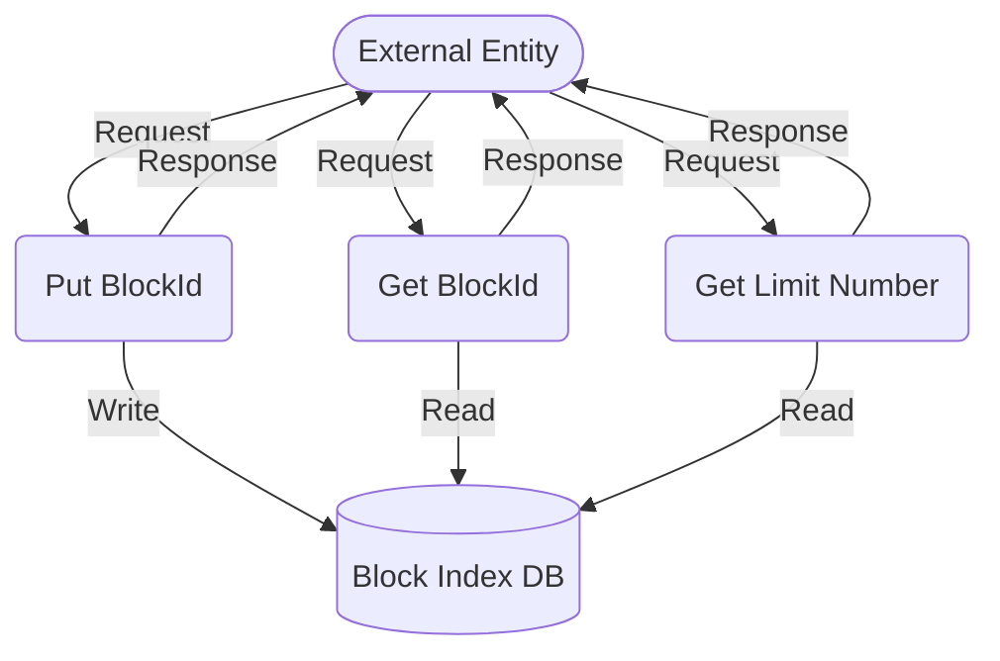

## Module: BlockIndexStore.java
模块名称：BlockIndexStore.java

**主要目标**：该模块的目的是为了在Tron区块链系统中管理区块索引，提供一个高效的方式来存储和检索区块信息。

**关键函数**：
- `put(BlockId id)`：将区块ID及其对应的数据存储起来。
- `get(Long num)`：根据区块的数字编号来检索区块ID，如果未找到则抛出`ItemNotFoundException`。
- `get(byte[] key)`：重载的get方法，根据给定的键（字节形式）来获取对应的`BytesCapsule`对象。
- `getLimitNumber(long startNumber, long limit)`：从指定的开始编号获取限定数量的区块ID列表。

**关键变量**：
- `dbName`：数据库名称，用于标识存储区块索引的数据库。

**交互依赖**：
- 依赖于`TronStoreWithRevoking`类，继承了其存储和撤销的功能。
- 与`revokingDB`交互，用于实际的数据存取操作。

**核心与辅助操作**：
- 核心操作包括：区块ID的存储和检索。
- 辅助操作包括：处理异常情况，如`ItemNotFoundException`。

**操作顺序**：
- 存储操作：首先将区块编号转换为字节数组，然后存储。
- 检索操作：根据区块编号检索，如果找不到相应数据，则抛出异常。

**性能方面**：
- 应考虑到数据存储和检索的效率，尤其是在区块链系统中，性能是关键考虑因素。

**可重用性**：
- 该模块设计为可重用的组件，可以在需要管理区块索引的其他系统或模块中使用。

**使用**：
- 在Tron区块链系统中，用于管理区块的索引信息，以便快速检索区块数据。

**假设**：
- 假设所有的区块ID都是唯一的，并且可以通过区块编号来唯一确定一个区块ID。
- 假设系统中已经有了有效的异常处理机制来处理`ItemNotFoundException`等异常情况。
## Flow Diagram [via mermaid]

