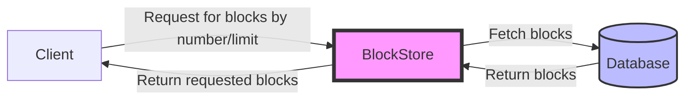

## Module: BlockStore.java
**模块名称**：BlockStore.java

**主要目标**：BlockStore模块的主要目的是管理区块链的区块存储，提供区块的存储、查询等功能。它是java-tron项目中负责区块数据处理的关键组件。

**关键功能**：
- `getLimitNumber(long startNumber, long limit)`：从指定的起始区块号开始，获取限定数量的区块。
- `getBlockByLatestNum(long getNum)`：获取最新的若干个区块。
- `pack(Set<byte[]> values)`：将从数据库中检索到的区块数据（以字节形式）转换成BlockCapsule对象，并进行排序。

**关键变量**：
- `BlockId startBlockId`：用于标识起始查询的区块ID。
- `List<BlockCapsule> blocks`：用于存储转换后的区块对象。

**依赖性**：该模块依赖于`TronStoreWithRevoking`进行数据的存取和撤销操作，同时使用`revokingDB`实例与数据库交互，依赖于`BlockCapsule`类来处理区块数据。

**主要操作 vs. 辅助操作**：
- 主要操作包括处理区块数据的存储和查询。
- 辅助操作包括将字节数据转换为区块对象、处理异常等。

**操作序列**：一般情况下，首先通过数据库查询功能检索区块数据，然后将字节数据转换为区块对象（BlockCapsule），最后对这些区块对象进行排序和返回。

**性能考虑**：在处理大量数据时，数据转换和排序可能会影响性能。优化数据结构和查询逻辑可能有助于提高效率。

**可重用性**：BlockStore模块设计为一个独立的组件，可在需要区块数据管理功能的其他项目中重用。

**使用**：在java-tron项目中，BlockStore模块用于管理区块链的区块数据，支持区块的存储、查询等操作。

**假设**：
- 假设存储的区块数据是完整且未损坏的。
- 假设在调用`getBlockByLatestNum`和`getLimitNumber`方法时，输入的参数是有效且合理的。

以上是对BlockStore.java模块的综合分析。
## Flow Diagram [via mermaid]

