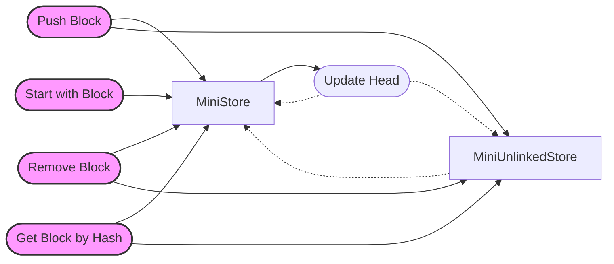

## Module: KhaosDatabase.java
- **模块名称**：KhaosDatabase.java
- **主要目标**：该模块的目的是管理和维护一个区块链数据库，特别是处理区块的插入、删除和查询，以及维护区块链的当前状态。
- **关键函数**：
  - `start(BlockCapsule blk)`：初始化数据库的头部区块。
  - `removeBlk(Sha256Hash hash)`：从数据库中移除指定哈希的区块。
  - `containBlock(Sha256Hash hash)`：检查一个区块是否存在于数据库中。
  - `getBlock(Sha256Hash hash)`：根据哈希获取一个区块。
  - `push(BlockCapsule blk)`：向数据库中插入一个区块，并更新头部区块。
  - `pop()`：移除头部区块。
  - `setMaxSize(int maxSize)`：设置数据库的最大容量。
  - `getBranch(Sha256Hash block1, Sha256Hash block2)`：找到两个区块的最近公共父区块。
- **关键变量**：
  - `KhaosBlock head`：当前数据库的头部区块。
  - `KhaosStore miniStore`和`KhaosStore miniUnlinkedStore`：用于存储已链接和未链接区块的存储。
- **相互依赖性**：该模块与系统的其他组件（例如区块链的其他部分）紧密相连，特别是依赖于`BlockCapsule`类来处理区块数据。
- **核心与辅助操作**：插入、删除和获取区块是核心操作；设置最大容量和获取分支操作则更多是辅助性的。
- **操作序列**：通常，操作开始于通过`start`方法初始化头部区块，随后可以插入新区块或移除旧区块，同时还可以查询特定区块的信息。
- **性能方面**：考虑到性能，特别是在维护区块链的当前状态和处理大量区块时的效率，使用了如`ConcurrentHashMap`这样的线程安全集合和其他优化措施。
- **可重用性**：该模块设计为可在不同的区块链项目中重用，尽管可能需要一些定制化以适应特定的需求。
- **使用**：主要被区块链系统内部使用，用于管理区块链数据库的状态，包括区块的添加、删除和查询等操作。
- **假设**：假设所有传入的区块都是有效的并且可以被验证。此外，还假设系统的其他部分（如网络通信和存储）能够正常工作。
## Flow Diagram [via mermaid]

