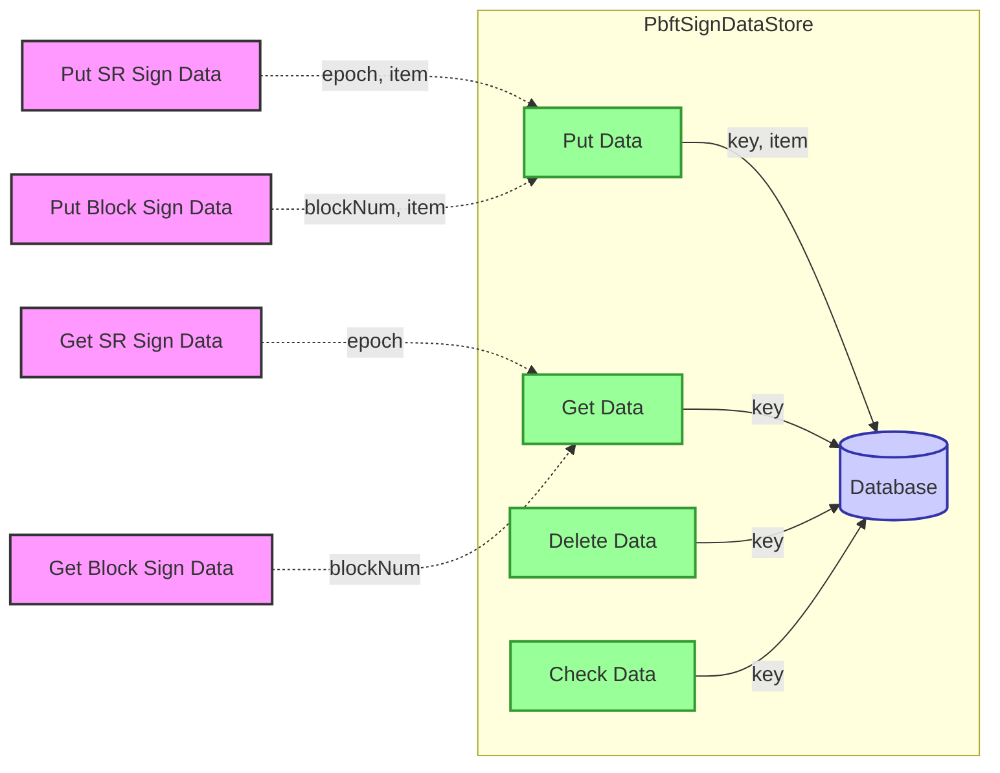

## Module: PbftSignDataStore.java
- **模块名称**: PbftSignDataStore.java

- **主要目标**: 该模块的目的是提供一个专用于存储和检索PBFT签名数据的数据库接口。它支持对PBFT签名数据的基本操作，如增加、查询和删除。

- **关键函数**:
  - `put(byte[] key, PbftSignCapsule item)`: 将给定的PBFT签名数据存储到数据库中。
  - `get(byte[] key)`: 根据给定的键从数据库中检索PBFT签名数据。
  - `delete(byte[] key)`: 从数据库中删除指定键的PBFT签名数据。
  - `has(byte[] key)`: 检查数据库中是否存在指定键的PBFT签名数据。
  - `putSrSignData(long epoch, PbftSignCapsule item)`: 存储特定epoch的SR签名数据。
  - `getSrSignData(long epoch)`: 获取特定epoch的SR签名数据。
  - `putBlockSignData(long blockNum, PbftSignCapsule item)`: 存储特定区块编号的区块签名数据。
  - `getBlockSignData(long blockNum)`: 获取特定区块编号的区块签名数据。

- **关键变量**:
  - `DataType.SRL` 和 `DataType.BLOCK`: 用于构建存储键的枚举，区分SR签名数据和区块签名数据。

- **互依赖性**: 该模块依赖于`TronDatabase`类提供的数据库操作功能，以及`PbftSignCapsule`类来封装PBFT签名数据。

- **核心与辅助操作**: 核心操作包括PBFT签名数据的存储、检索和删除。辅助操作包括构建用于存储和检索数据的键的方法。

- **操作序列**: 通常，操作序列开始于存储PBFT签名数据，然后可能根据需要检索或删除这些数据。

- **性能方面**: 性能考虑包括确保数据存取的高效性，特别是在构建键和处理大量数据时。

- **可重用性**: 该模块设计为可重用，可以轻松集成到需要PBFT签名数据存储和检索功能的任何系统中。

- **使用**: 该模块在需要对PBFT签名数据进行管理的系统中使用，例如在基于PBFT算法的区块链系统中。

- **假设**: 假设存储的数据格式正确且有效，且调用方负责提供有效的键和数据。
## Flow Diagram [via mermaid]

