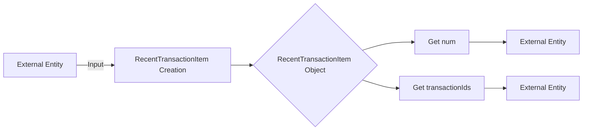

## Module: RecentTransactionItem.java
- **模块名称**: RecentTransactionItem.java

- **主要目标**: 该模块的目的是定义一个表示最近交易项的类，用于存储与特定区块编号相关联的一系列交易ID。

- **关键功能**:
  - `RecentTransactionItem()`: 一个无参数构造函数，用于创建RecentTransactionItem实例。
  - `RecentTransactionItem(long num, List<String> transactionIds)`: 一个带参数的构造函数，用于初始化区块编号和相关联的交易ID列表。
  - `getNum()`: 获取区块编号。
  - `setNum(long num)`: 设置区块编号。
  - `getTransactionIds()`: 获取交易ID列表。
  - `setTransactionIds(List<String> transactionIds)`: 设置交易ID列表。

- **关键变量**:
  - `num`: 表示区块编号的长整型变量。
  - `transactionIds`: 表示与该区块编号相关联的交易ID列表的变量。

- **相互依赖性**: 该类主要与交易处理和区块链数据库管理的其他部分交互，用于存储和检索最近的交易信息。

- **核心与辅助操作**: 
  - 核心操作包括通过构造函数初始化实例、获取和设置区块编号以及交易ID列表。
  - 辅助操作可能包括与其他系统组件的交互，例如在数据库中检索或更新交易信息时。

- **操作序列**: 通常，首先通过构造函数创建RecentTransactionItem实例，然后可以通过相应的getter和setter方法获取或更新区块编号和交易ID列表。

- **性能方面**: 在处理大量交易时，维护交易ID列表的效率非常重要。选择合适的数据结构来存储这些ID可以显著影响性能。

- **可重用性**: RecentTransactionItem类设计得相对简单，易于理解和使用，可以轻松地在需要管理交易信息的其他模块或系统中重用。

- **使用**: 该类被用于记录和管理与特定区块编号相关联的交易信息，可以在交易查询、审计或区块链数据分析等功能中使用。

- **假设**: 
  - 假设每个区块编号是唯一的，并且与一组特定的交易ID相关联。
  - 假设交易ID列表中的ID是有效和唯一的，不会出现重复。
## Flow Diagram [via mermaid]

