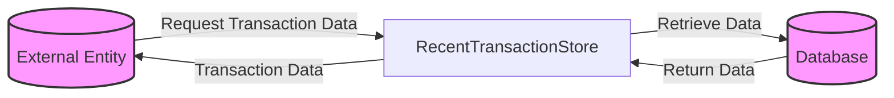

## Module: RecentTransactionStore.java
- **模块名称**: RecentTransactionStore.java

- **主要目的**: 此模块的主要目的是提供一个存储和检索最近交易信息的机制。它继承自TronStoreWithRevoking，专门用于处理字节类型的交易数据。

- **关键功能**:
  - `get(byte[] key)`: 根据提供的键（通常是交易ID）获取对应的交易信息。如果找不到信息，会抛出`ItemNotFoundException`异常。

- **关键变量**:
  - `dbName`: 数据库名称，通过构造函数注入，指定存储交易信息的数据库。
  - `revokingDB`: 继承自父类的变量，用于实际的数据存储和检索操作。

- **相互依赖性**: 该模块依赖于Spring框架提供的依赖注入机制（通过`@Autowired`和`@Value`注解）来获取数据库名称，并且依赖于`TronStoreWithRevoking`类提供的底层存储机制。

- **核心与辅助操作**:
  - 核心操作: `get(byte[] key)`方法是此模块的核心功能，用于获取交易数据。
  - 辅助操作: 构造函数用于初始化模块，设置数据库名称。

- **操作顺序**: 用户通过调用`get(byte[] key)`方法来查询特定的交易数据。如果键存在，返回对应的交易信息；如果键不存在，则抛出异常。

- **性能方面**: 性能考虑可能包括如何有效地存储和检索大量的交易数据。使用`revokingDB`的底层存储机制需要优化以确保高效的数据访问。

- **可重用性**: 由于此模块专门用于处理特定类型的数据（即交易数据），其可重用性可能受到一定限制。但是，通过修改或扩展，可以适应不同的数据存储需求。

- **使用方式**: 此模块主要被区块链系统中需要快速访问最近交易记录的组件使用。通过提供交易ID作为键，可以快速检索交易信息。

- **假设**: 
  - 假设存储的交易数据是最近的，因此不需要长期存储大量历史数据。
  - 假设调用者能够处理`ItemNotFoundException`，以适当方式响应未找到交易的情况。
## Flow Diagram [via mermaid]

