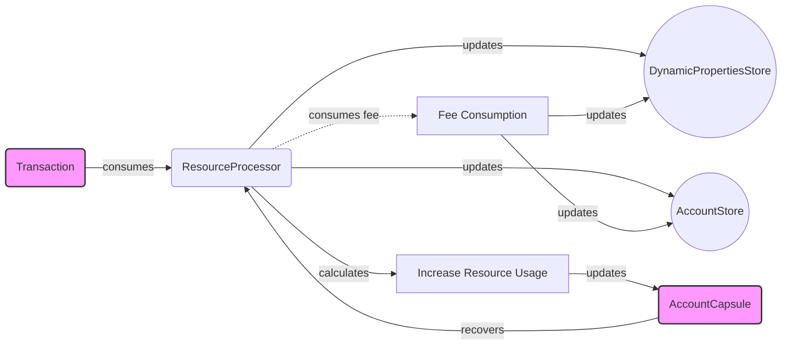

## Module: ResourceProcessor.java
根据提供的代码模块，以下是用中文进行的全面分析：

- **模块名称**：ResourceProcessor.java

- **主要目标**：该模块的目的是处理与交易相关的资源消耗，包括带宽和能量的计算及其消耗。

- **关键功能**：
  - `consume`：抽象方法，根据交易情况消耗资源。
  - `increase`：计算资源使用量的增加。
  - `recovery`：恢复账户资源使用情况。
  - `unDelegateIncrease` 和 `unDelegateIncreaseV2`：处理资源委托和转移时的资源增加。
  - `consumeFeeForBandwidth` 和 `consumeFeeForNewAccount`：处理带宽和创建新账户时的费用消耗。

- **关键变量**：
  - `dynamicPropertiesStore`：动态属性存储，用于访问链上的动态配置。
  - `accountStore`：账户存储，用于访问账户信息。
  - `precision`、`windowSize`、`averageWindowSize`：用于资源计算的精度和窗口大小参数。

- **相互依赖性**：该模块依赖于`DynamicPropertiesStore`和`AccountStore`来获取链上的配置和账户信息，同时，其操作可能影响账户的状态和链上的资源分配。

- **核心与辅助操作**：核心操作包括资源的计算和消耗，辅助操作包括费用的处理和异常的处理。

- **操作序列**：首先，通过`consume`方法根据交易类型和详情计算资源消耗；接着，可能会调用`increase`、`recovery`等方法来更新资源使用情况；最后，通过`consumeFeeForBandwidth`等方法处理相关费用。

- **性能方面**：该模块需要高效地处理资源计算和更新，特别是在高并发交易环境下，性能是关键考量之一。

- **可重用性**：该模块设计为抽象类，通过继承和实现其方法，可以轻松适应不同的资源处理需求，具有较高的可重用性。

- **使用**：在交易处理流程中，当需要计算和消耗资源时，会使用到此模块。

- **假设**：该模块假设所有的输入参数都是有效的，并且依赖的存储系统能够正确地返回所需的信息。此外，还假设系统的时间戳是准确的，用于计算资源的使用和恢复。

这个分析提供了对`ResourceProcessor`模块功能和结构的全面理解，包括它如何与系统的其他部分交互，以及它在资源管理中的关键作用。
## Flow Diagram [via mermaid]

