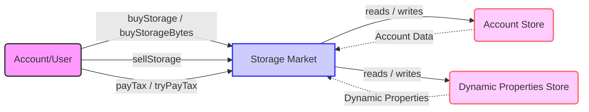

## Module: StorageMarket.java
由于您提供的代码较长且复杂，我将根据您的要求进行简化分析。请注意，这是一个基于您提供的代码片段的大致分析，可能无法完全准确反映所有细节。

- **模块名称**: StorageMarket.java

- **主要目标**: 此模块的目的是管理存储市场，包括存储的买卖、计算税费以及更新账户的存储限额等功能。

- **关键函数**:
  - `exchangeToSupply` 和 `exchangeToSupply2`: 这两个方法负责处理存储的买卖交易，计算新的供应量。
  - `exchange_from_supply`: 根据供应量计算交换余额。
  - `exchange`: 执行存储的买卖操作。
  - `calculateTax` 和 `tryPayTax`: 计算和尝试支付存储税。
  - `buyStorageBytes` 和 `buyStorage`: 购买存储空间。
  - `sellStorage`: 出售存储空间。
  - `getAccountLeftStorageInByteFromBought`: 获取账户剩余的存储字节数。

- **关键变量**:
  - `accountStore`: 账户存储。
  - `dynamicPropertiesStore`: 动态属性存储。
  - `supply`: 供应量。

- **互依赖性**: 此模块与`AccountStore`和`DynamicPropertiesStore`有密切的互动，用于存取账户信息和动态属性。

- **核心与辅助操作**:
  - 核心操作包括存储的买卖、税费的计算和支付。
  - 辅助操作可能包括日志记录和辅助性的计算。

- **操作序列**: 典型的操作序列可能是用户请求购买或出售存储，模块计算相应的价格和税费，更新账户的存储限额和余额。

- **性能方面**: 性能考虑可能包括确保交易的效率和减少对存储和数据库的访问次数。

- **可重用性**: 此模块的设计允许它在不同的上下文中重用，特别是与存储市场相关的任何功能。

- **使用**: 此模块被用于处理与存储市场相关的所有事务，包括购买、出售存储空间和税费的处理。

- **假设**:
  - 存在一个有效的、可访问的账户和动态属性存储系统。
  - 供应量和税率等动态属性可以被正确地更新和访问。

请注意，这只是基于您提供的代码的一个高层次概述。实际的实现细节可能会有所不同。
## Flow Diagram [via mermaid]

