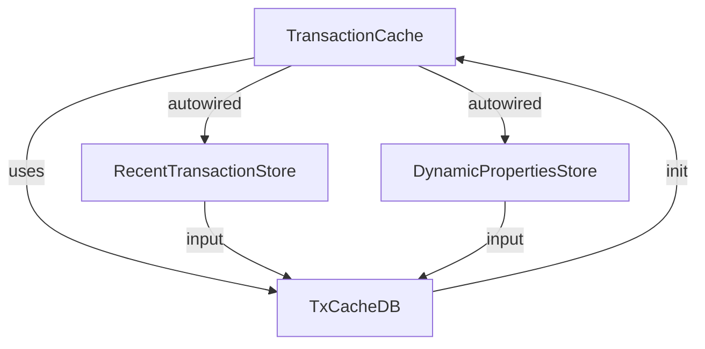

## Module: TransactionCache.java
- **模块名称**：TransactionCache.java

- **主要目标**：该模块的目的是为了管理和优化对交易数据的缓存处理，以提高数据访问的效率和性能。

- **关键功能**：
  - `initCache()`：初始化缓存，这是设置缓存状态的关键方法，确保在使用缓存之前，缓存是按照预期配置好的。

- **关键变量**：
  - `dbName`：数据库名，用于标识不同的缓存数据库。
  - `recentTransactionStore`：最近交易存储，与交易缓存紧密相关，用于存储最近的交易数据。
  - `dynamicPropertiesStore`：动态属性存储，可能用于配置或调整缓存策略的动态参数。

- **相互依赖性**：
  - 该模块与`RecentTransactionStore`和`DynamicPropertiesStore`有直接的依赖关系，这表明它不仅负责缓存管理，还与系统的其他部分（如最近的交易处理和动态配置管理）紧密集成。

- **核心与辅助操作**：
  - 核心操作：初始化缓存（`initCache()`）是核心操作，因为它为缓存使用建立了基础。
  - 辅助操作：与`RecentTransactionStore`和`DynamicPropertiesStore`的交互可以视为辅助操作，因为它们支持缓存操作的上下文环境。

- **操作序列**：
  - 在`TransactionCache`的使用中，首先应当调用`initCache()`方法来初始化缓存，之后才能进行高效的缓存操作。这保证了缓存是在正确的状态下被使用。

- **性能方面**：
  - 通过使用缓存，可以显著提高交易数据访问的速度和效率。性能的关键在于如何有效管理缓存，包括缓存的初始化、更新和查询。

- **可重用性**：
  - `TransactionCache`设计为可重用的组件，它可以被不同的模块和服务用于提高交易数据处理的性能。其可重用性体现在通过配置不同的数据库名和与其他存储的交互来适应不同的使用场景。

- **使用**：
  - 该模块主要用于优化交易数据的存取，特别是在高频访问场景下，通过缓存最近的交易数据来减少数据库的访问压力和提高响应速度。

- **假设**：
  - 假设存在高效的底层数据库支持，这样`TxCacheDB`才能有效地实现其缓存策略。
  - 还假设系统的其他部分（如`RecentTransactionStore`和`DynamicPropertiesStore`）能够提供必要的数据和配置支持，以便`TransactionCache`能够正常工作。
## Flow Diagram [via mermaid]

