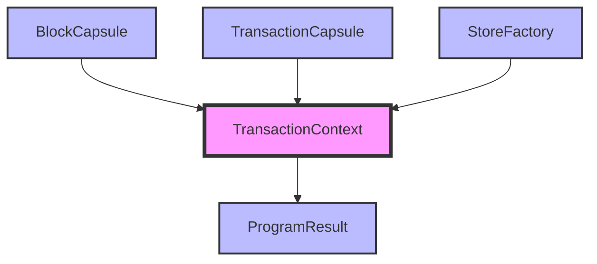

## Module: TransactionContext.java
**模块名称**: TransactionContext.java

**主要目标**: 此模块的目的是为了封装交易执行的上下文信息，提供一个执行环境的快照，使得交易的处理能够在一个清晰定义的环境中进行。

**关键函数**:
- 构造函数: 用于初始化`TransactionContext`对象，设置区块信息(`BlockCapsule`)、交易信息(`TransactionCapsule`)、存储工厂(`StoreFactory`)、是否为静态调用以及事件插件是否加载。

**关键变量**:
- `blockCap`: 区块信息，类型为`BlockCapsule`。
- `trxCap`: 交易信息，类型为`TransactionCapsule`。
- `storeFactory`: 存储工厂，用于访问底层数据存储。
- `programResult`: 程序执行结果，类型为`ProgramResult`。
- `isStatic`: 表示调用是否为静态。
- `eventPluginLoaded`: 表示事件插件是否已加载。

**相互依赖**:
- 依赖于`BlockCapsule`、`TransactionCapsule`、`StoreFactory`等类提供的数据结构和功能，以及可能与事件处理插件的交互（如果已加载）。

**核心与辅助操作**:
- 核心操作: 初始化和提供交易执行的上下文信息。
- 辅助操作: 包括设置和获取上述关键变量的值。

**操作顺序**:
- 在执行交易之前，首先通过构造函数初始化`TransactionContext`对象，设置所有必要的上下文信息。

**性能方面**:
- 性能考虑可能包括对象的创建和初始化开销，以及如何有效地访问和管理上下文信息。

**可重用性**:
- 此类设计为可重用，可为不同的交易执行提供上下文环境，只需通过构造函数传入不同的参数即可。

**使用**:
- 在交易处理流程中使用，为交易执行提供必要的上下文信息。

**假设**:
- 假设存在有效的`BlockCapsule`、`TransactionCapsule`和`StoreFactory`实例。
- 假设调用者正确处理`isStatic`和`eventPluginLoaded`标志。

通过上述分析，我们可以看出`TransactionContext`模块在交易处理流程中扮演着重要的角色，它通过封装交易执行所需的上下文信息，为交易的正确执行提供了必要的环境和参数。
## Flow Diagram [via mermaid]

