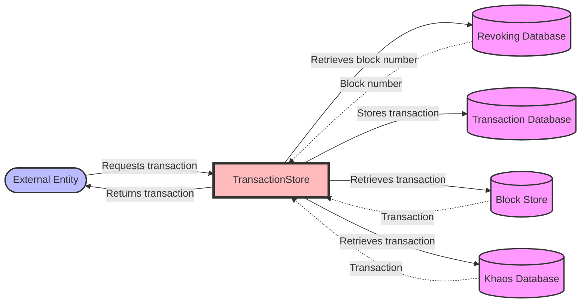

## Module: TransactionStore.java
根据提供的代码模块，以下是以中文进行的全面分析：

- **模块名称**：TransactionStore.java

- **主要目标**：该模块的主要目标是提供对交易数据的存储、检索和管理功能。它允许将交易数据存储在数据库中，并能够从数据库中检索交易信息。

- **关键函数**：
  - `put(byte[] key, TransactionCapsule item)`：将交易数据存储到数据库中。
  - `getTransactionFromBlockStore(byte[] key, long blockNum)`：从区块存储中检索交易信息。
  - `getTransactionFromKhaosDatabase(byte[] key, long high)`：从Khaos数据库中检索交易信息。
  - `getBlockNumber(byte[] key)`：根据键值获取交易所在的区块编号。
  - `get(byte[] key)`：根据键值检索交易信息。
  - `getUnchecked(byte[] key)`：尝试检索交易信息，但不抛出异常。
  - `getTotalTransactions()`：获取总交易数（已弃用）。

- **关键变量**：
  - `blockStore`：区块存储的引用。
  - `khaosDatabase`：Khaos数据库的引用。
  - `dbName`：数据库名称。

- **相互依赖性**：该模块与`BlockStore`和`KhaosDatabase`模块紧密相关，依赖这些模块来检索交易所在的区块信息或通过区块高度来检索交易信息。

- **核心与辅助操作**：核心操作包括交易数据的存储和检索。辅助操作可能包括通过不同方式获取交易信息的功能，如`getTransactionFromBlockStore`和`getTransactionFromKhaosDatabase`。

- **操作序列**：一般而言，操作序列开始于存储交易数据，然后根据需要检索交易信息，可能会先尝试从区块存储中获取，如果失败，再从Khaos数据库中获取。

- **性能方面**：性能考虑可能包括如何高效地存储和检索大量的交易数据，以及如何优化数据库的查询性能。

- **可重用性**：该模块设计为可重用组件，可以在需要管理交易数据的不同部分的系统中使用。

- **使用**：该模块主要用于交易数据的管理，包括存储、检索和更新交易信息。

- **假设**：在设计该模块时，可能做出的假设包括系统中存在有效的区块链数据结构，以及数据库连接和操作是高效且可靠的。

这个分析提供了对TransactionStore模块功能和设计的综合概述，以及它在系统中的作用。
## Flow Diagram [via mermaid]

