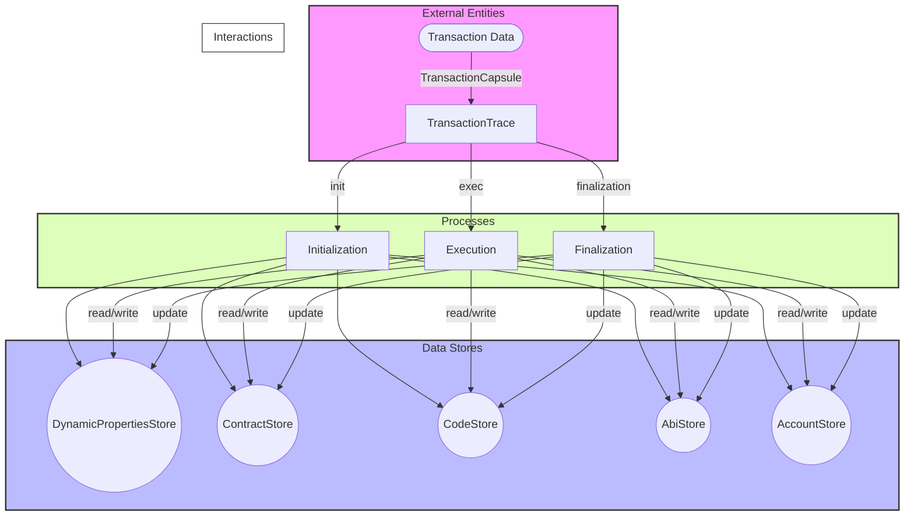

## Module: TransactionTrace.java
由于直接翻译代码模块的详细分析到中文可能会导致一些细节丢失或误解，我将尽量提供一个准确的概括性分析。请注意，这种分析可能不会涵盖代码的所有细节，但会尝试突出其主要功能和特性。

- **模块名称**：TransactionTrace.java

- **主要目标**：该模块的目的是跟踪和处理Tron区块链上的交易，包括执行智能合约调用、创建智能合约等。

- **关键函数**：
  - `init`：初始化交易追踪，设置交易上下文。
  - `exec`：执行交易，调用虚拟机执行智能合约。
  - `setBill`、`setPenalty`、`setNetBill`：设置交易的能量使用、罚款和网络费用。
  - `finalization`：完成交易处理，包括支付费用等。
  - `pay`：处理交易费用支付逻辑。
  - `deleteContract`：删除智能合约。

- **关键变量**：
  - `trx`：当前处理的交易。
  - `receipt`：交易的收据，记录了费用等信息。
  - `storeFactory`、`dynamicPropertiesStore`、`contractStore` 等：与区块链状态和存储相关的组件。

- **互依赖性**：该模块与区块链的其他组件紧密相关，如存储、智能合约处理等。

- **核心 vs. 辅助操作**：执行交易和处理支付逻辑是核心操作；初始化和设置费用等是辅助操作。

- **操作序列**：首先初始化交易追踪，然后执行交易，最后完成交易处理，包括支付费用等。

- **性能方面**：考虑到交易的执行和费用处理可能涉及复杂的计算和状态更新，性能是一个重要考虑因素。

- **可重用性**：该模块设计为可在不同的交易和区块链状态下重用。

- **使用**：主要用于Tron区块链的节点软件中，处理和追踪交易。

- **假设**：假设区块链的存储和状态管理组件是可靠的，智能合约遵循Tron平台的规范。

请注意，这个分析基于代码片段的阅读和理解，可能不完全准确。在实际开发和使用过程中，应详细阅读和理解相关文档和代码。
## Flow Diagram [via mermaid]

