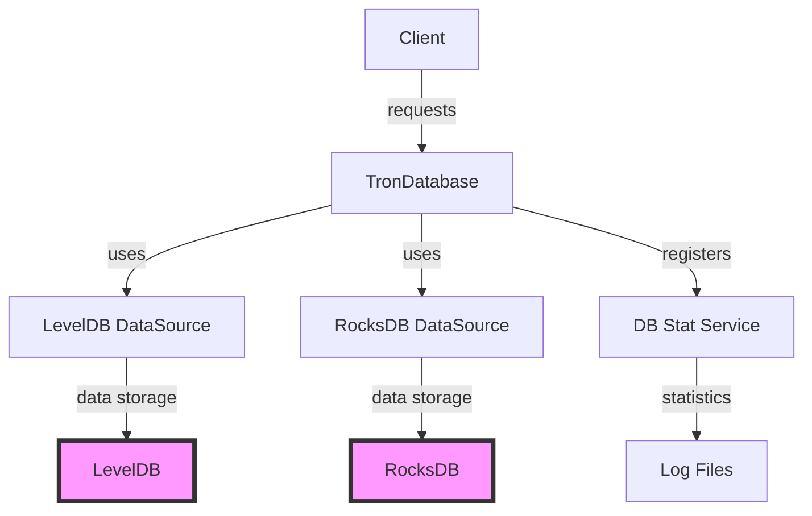

## Module: TronDatabase.java
基于提供的代码模块，以下是其综合分析：

- **模块名称**：TronDatabase.java

- **主要目标**：定义了一个抽象类TronDatabase，其目的是为Tron区块链项目提供一个通用的数据库访问层，支持LevelDB和RocksDB两种存储引擎。

- **关键函数**：
  - `TronDatabase(String dbName)`：构造函数，根据数据库名称和存储引擎初始化数据库源。
  - `init()`：初始化方法，用于数据库状态的注册。
  - `getOptionsByDbNameForLevelDB(String dbName)`：获取LevelDB的配置选项。
  - `getDirectComparator()`：获取RocksDB的比较器，目前返回null，可能需要子类实现。
  - `updateByBatch(Map<byte[], byte[]> rows)`：批量更新数据。
  - `reset()`：重置数据库。
  - `close()`：关闭数据库。
  - `put(byte[] key, T item)`：抽象方法，用于插入数据。
  - `delete(byte[] key)`：抽象方法，用于删除数据。
  - `get(byte[] key)`：抽象方法，用于获取数据。
  - `has(byte[] key)`：抽象方法，用于判断数据是否存在。

- **关键变量**：
  - `dbSource`：数据库源，负责底层数据存储操作。
  - `dbName`：数据库名称。
  - `writeOptions`：写操作的配置选项。
  - `dbStatService`：数据库状态服务，用于监控和统计。

- **依赖关系**：
  - 与`LevelDbDataSourceImpl`和`RocksDbDataSourceImpl`类有直接的依赖关系，这两个类分别实现了LevelDB和RocksDB的具体操作。
  - 依赖`DbStatService`进行数据库状态的监控和统计。

- **核心与辅助操作**：
  - 核心操作包括数据库的初始化、数据的增删改查。
  - 辅助操作包括数据库的状态监控和统计。

- **操作序列**：
  - 通常首先进行数据库的初始化（构造函数和`init`方法），然后进行数据的增删改查操作。

- **性能方面**：
  - 性能考虑主要体现在对LevelDB和RocksDB的支持上，通过配置不同的存储引擎和写操作的同步/异步模式来优化性能。

- **可重用性**：
  - 该模块通过抽象类设计，提供了一套通用的数据库访问接口，易于扩展和重用。

- **使用**：
  - 作为Tron区块链项目的数据库访问层，被其他需要数据存取的模块所使用。

- **假设**：
  - 假设存储引擎配置正确，并且数据库状态服务可用于监控和统计。

通过以上分析，我们可以看到TronDatabase模块为Tron区块链项目提供了一个灵活、高效的数据库访问层，支持多种存储引擎，易于扩展和维护。
## Flow Diagram [via mermaid]

