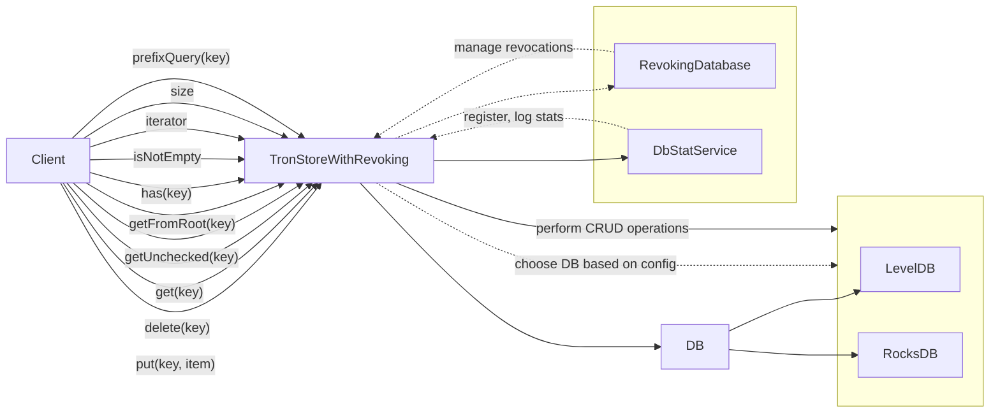

## Module: TronStoreWithRevoking.java
由于您提供的代码是一个Java类，我将根据这个类的内容来生成分析报告。

- **模块名称**：TronStoreWithRevoking

- **主要目标**：这个模块的主要目的是为Tron区块链提供一个具有撤销功能的存储机制。它允许对存储的数据进行增删改查操作，并支持从存储的快照中恢复数据。

- **关键函数**：
  - `put(byte[] key, T item)`：将数据项存储到数据库中。
  - `delete(byte[] key)`：从数据库中删除指定的数据项。
  - `get(byte[] key)`：根据键从数据库中检索数据项。
  - `getUnchecked(byte[] key)`：类似于`get`方法，但不抛出异常。
  - `getFromRoot(byte[] key)`：从根快照中检索数据项。
  - `of(byte[] value)`：将字节数组转换为数据项实例。
  - `has(byte[] key)`：检查数据库中是否存在指定的键。
  - `isNotEmpty()`：检查数据库是否不为空。
  - `iterator()`：返回一个迭代器，用于遍历数据库中的所有数据项。
  - `size()`：返回数据库中数据项的数量。
  - `setCursor(Chainbase.Cursor cursor)`：设置数据库的游标。
  - `prefixQuery(byte[] key)`：执行前缀查询。

- **关键变量**：
  - `revokingDB`：用于数据撤销操作的数据库实例。
  - `db`：底层数据库实例，可以是LevelDB或RocksDB。

- **互依赖性**：此模块依赖于`LevelDbDataSourceImpl`和`RocksDbDataSourceImpl`来实现具体的数据库操作。同时，它与`DbStatService`和`RevokingDatabase`进行交互，用于数据库状态的监控和撤销操作的管理。

- **核心与辅助操作**：核心操作包括数据的增删改查以及从快照中恢复数据。辅助操作包括数据库的初始化（`init`方法）、关闭（`close`方法）和重置（`reset`方法）。

- **操作序列**：在使用数据库进行操作之前，需要先进行初始化（通过`@PostConstruct`注解的`init`方法）。数据的增删改查操作则根据具体的业务需求进行。

- **性能方面**：性能考虑包括数据库的选择（LevelDB或RocksDB）、数据库操作的同步性以及JNI迭代器的关闭处理。

- **可重用性**：由于这是一个抽象类，它被设计为可扩展的，允许通过继承来实现特定类型的数据存储。

- **使用**：此模块被设计为Tron区块链的一部分，用于管理区块链数据的存储和撤销操作。

- **假设**：假设底层数据库已经正确配置，并且使用者熟悉Tron区块链的存储需求。

这个分析基于您提供的代码段，旨在提供一个概览性的解读。具体实现细节和使用场景可能需要进一步查看相关文档和代码。
## Flow Diagram [via mermaid]

