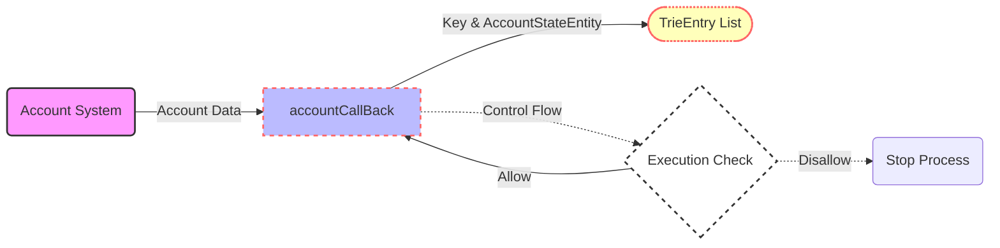

## Module: AccountStateCallBackUtils.java
- **模块名称**：AccountStateCallBackUtils.java

- **主要目标**：该模块的目的是提供一个机制，用于在特定条件下回调账户状态信息，并将这些信息转换为特定格式存储或进一步处理。

- **关键功能**：
  - `accountCallBack(byte[] key, AccountCapsule item)`：当满足执行条件时，将账户信息添加到trieEntryList中。
  - `exe()`：检查是否满足执行条件，即是否允许生成根节点和执行标志是否为true。

- **关键变量**：
  - `execute`：控制是否执行回调的布尔标志。
  - `allowGenerateRoot`：控制是否允许生成根节点的布尔标志。
  - `trieEntryList`：存储TrieEntry对象的列表，用于收集账户状态信息。

- **依赖关系**：
  - 该模块依赖于`AccountCapsule`类来获取账户信息，并使用`AccountStateEntity`类来转换账户信息格式。

- **核心与辅助操作**：
  - 核心操作包括条件检查（通过`exe()`方法）和账户信息的回调处理（通过`accountCallBack`方法）。
  - 辅助操作包括TrieEntry的构建和数据设置。

- **操作序列**：
  1. 检查执行条件（`exe()`方法）。
  2. 如果条件满足，通过`accountCallBack`方法处理账户信息。
  3. 将账户信息转换为TrieEntry并添加到列表中。

- **性能方面**：
  - 性能考虑可能包括处理大量账户信息时的内存使用和处理速度。

- **可重用性**：
  - 该模块通过提供灵活的回调机制和账户信息格式转换，具有较好的可重用性，可以在需要收集和处理账户状态信息的不同场景中使用。

- **使用**：
  - 在需要根据特定条件回调和处理账户状态信息的系统组件中使用，如在区块链系统中生成账户状态根。

- **假设**：
  - 假设存在有效的账户信息（`AccountCapsule`对象）。
  - 假设调用`accountCallBack`方法之前已经设置了执行条件（`execute`和`allowGenerateRoot`变量）。
## Flow Diagram [via mermaid]

