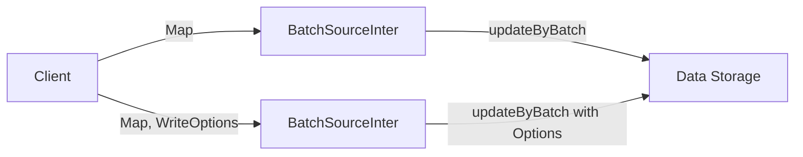

## Module: BatchSourceInter.java
### 模块名称
`BatchSourceInter.java`

### 主要目标
该模块的主要目的是定义一个批量更新数据的接口，用于以批量方式操作键值对数据。这是在区块链技术栈中，特别是在以太坊J（ethereumJ）库中使用的，以高效地处理数据存储和访问。

### 关键功能
- `updateByBatch(Map<K, V> rows)`: 无选项的批量更新方法，接受一个键值对映射作为参数，用于更新数据源中的数据。
- `updateByBatch(Map<K, V> rows, WriteOptionsWrapper writeOptions)`: 带有写入选项的批量更新方法，允许在更新操作中指定特定的写入行为。

### 关键变量
- `Map<K, V> rows`: 表示要批量更新的数据集合。
- `WriteOptionsWrapper writeOptions`: 表示批量更新操作的写入选项。

### 互依赖性
该模块依赖于`SourceInter<K, V>`接口，扩展了基本的数据源操作，以支持批量处理。此外，还可能与系统中负责数据持久化和访问的其他组件有互动。

### 核心与辅助操作
- 核心操作包括两种形式的`updateByBatch`方法，这是接口的直接职责。
- 辅助操作可能包括与写入选项相关的逻辑处理，以及与其他系统组件的交互。

### 操作序列
由于是接口定义，操作序列依赖于实现该接口的具体类。通常，批量更新操作会先准备数据集合，然后根据需要选择是否应用写入选项，最后执行更新。

### 性能方面
批量更新可以显著提高数据处理效率，减少I/O操作次数。写入选项的使用可能进一步优化性能，例如，通过减少磁盘同步次数。

### 可重用性
作为一个通用接口，`BatchSourceInter`设计用于不同的数据源实现，具有较高的可重用性。它可以应用于任何需要批量数据处理的场景。

### 使用
在以太坊J库或类似的区块链技术栈中，该接口可用于实现数据层的批量更新逻辑，特别是在处理大量数据时提供性能优势。

### 假设
- 假设存在一个有效的键值对映射作为输入。
- 假设调用者理解并正确使用可选的写入选项来优化性能。
- 假设实现此接口的类能够处理大量数据的批量写入操作。

通过这个分析，我们可以看到`BatchSourceInter`接口在以太坊J库中扮演着重要的角色，特别是在提高数据处理性能和效率方面。
## Flow Diagram [via mermaid]

