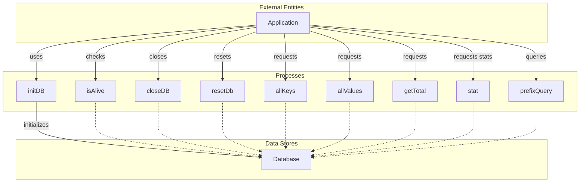

## Module: DbSourceInter.java
由于您要求的分析相对详细且具体，我将基于所提供的代码模块信息，尽可能以中文进行解读：

- **模块名称**：DbSourceInter.java
- **主要目标**：定义一个接口，用于规范数据库源操作，包括初始化、状态检查、关闭数据库、重置数据库、查询等功能。
- **关键功能**：
  - `getDBName()`：获取数据库名称。
  - `setDBName(String name)`：设置数据库名称。
  - `initDB()`：初始化数据库。
  - `isAlive()`：检查数据库是否处于活动状态。
  - `closeDB()`：关闭数据库。
  - `resetDb()`：重置数据库。
  - `allKeys()`：获取所有键的集合。
  - `allValues()`：获取所有值的集合。
  - `getTotal()`：获取数据库中条目的总数。
  - `stat()`：获取数据库的统计信息。
  - `prefixQuery(byte[] key)`：根据前缀查询键值对。
- **关键变量**：此接口未直接定义变量，但通过方法参数和返回类型，如`byte[] key`和`V`（值的泛型），暗示了数据库操作的基本元素。
- **互依性**：该接口作为数据库操作的抽象，可能依赖具体的数据库实现（如SQL数据库、NoSQL数据库等）和数据模型（如`WrappedByteArray`）。
- **核心与辅助操作**：核心操作包括数据库的初始化、状态检查、读写操作等；辅助操作可能包括设置数据库名称、获取统计信息等。
- **操作序列**：典型的操作序列可能包括：设置数据库名称 -> 初始化数据库 -> 执行数据库操作（如查询、插入）-> 关闭数据库。
- **性能方面**：性能考虑可能包括数据库操作的响应时间、数据访问的效率、以及如何优化大量数据的处理。
- **可重用性**：作为一个接口，`DbSourceInter`旨在提供一套标准，使得不同的数据库实现可以在保持一致性的基础上进行适配和重用。
- **使用**：该接口可能被数据库管理类或数据访问对象（DAO）实现，以提供应用程序所需的具体数据库操作。
- **假设**：在设计此接口时，可能假设数据库操作是异步的，或者至少需要处理可能的并发访问和数据一致性问题。

请注意，此分析基于接口定义进行，具体实现细节可能会有所不同。
## Flow Diagram [via mermaid]

