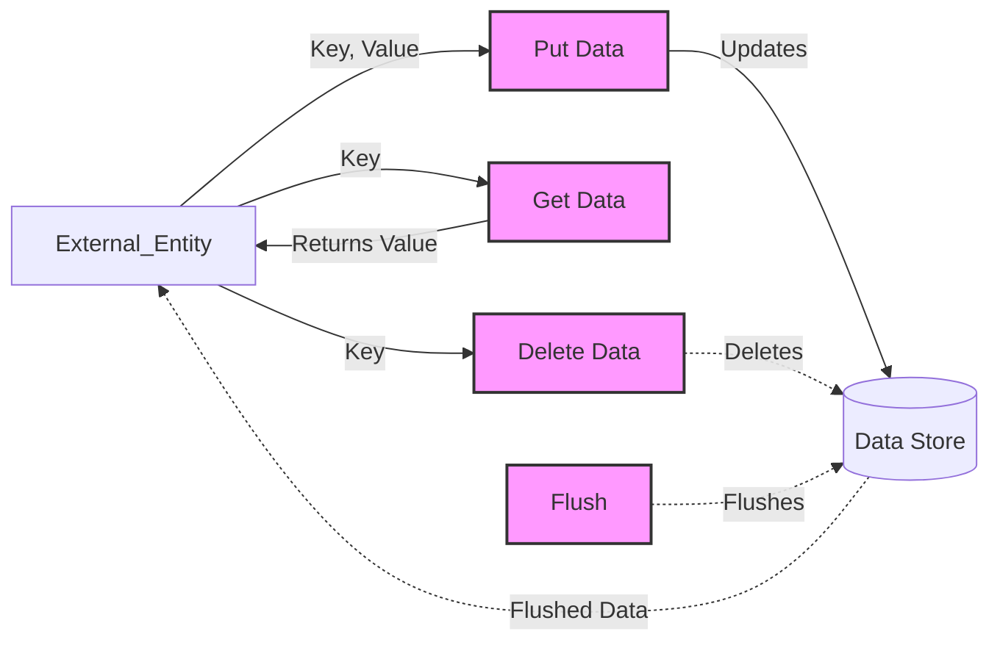

## Module: SourceInter.java
基于提供的代码模块，以下是用中文进行的综合分析：

- **模块名称**：SourceInter.java
- **主要目标**：定义了一个接口，旨在规范数据源操作的基本方法，以便在不同的数据存储实现之间提供一致的访问方式。这个接口是为了在以太坊J（ethereumJ）库中使用，特别是在处理区块链数据时。
- **关键功能**：
  - `putData(K key, V val)`：将键值对数据存储到数据源中。
  - `getData(K key)`：根据键值检索数据。
  - `deleteData(K key)`：根据键值删除数据。
  - `flush()`：确保所有挂起的数据操作都被持久化到数据源中，返回值表示操作是否成功。
- **关键变量**：由于这是一个接口，所以直接的变量定义较少，关键在于方法的参数`K key`和`V val`，代表键和值。
- **互依性**：这个接口定义了与数据源交互的标准方法，它的实现类需要与具体的数据存储技术（如数据库或文件系统）进行交互，同时可能会被应用层的不同部分调用来进行数据操作。
- **核心 vs. 辅助操作**：所有定义的方法都是核心操作，它们共同定义了数据源操作的基本框架。没有明显的辅助操作。
- **操作序列**：接口本身不定义具体的操作序列，操作序列将由实现这个接口的类来确定。
- **性能方面**：性能考虑将依赖于接口实现的具体方式。例如，`flush()`方法的实现效率直接影响数据的持久化速度和应用的响应时间。
- **可重用性**：这个接口高度抽象，可以轻松地在不同的数据存储解决方案之间进行重用，增强了代码的模块化和可维护性。
- **使用**：在以太坊J库中，任何需要持久化键值对数据的组件都可以通过实现这个接口来与数据源交互。这包括账户状态、交易信息和区块数据等。
- **假设**：在设计这个接口时，假设实现它的类将能够处理任何必要的数据序列化和反序列化，以及处理与具体数据存储技术相关的任何异常情况。

这个接口的设计体现了对扩展性和灵活性的重视，使得以太坊J库能够更容易地适应不同的数据存储需求，同时也便于维护和升级。
## Flow Diagram [via mermaid]

