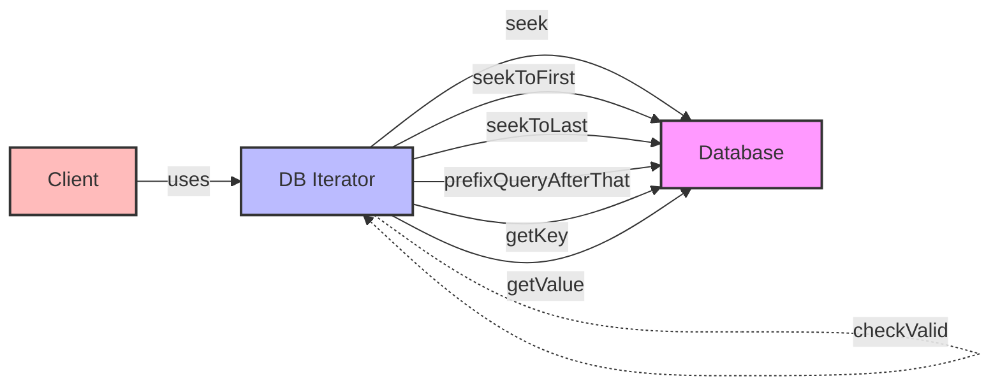

## Module: DBIterator.java
模块名称：DBIterator.java

主要目标：该模块的目的是提供一个迭代器接口，用于在数据库中遍历键值对，支持基本的迭代操作以及特定的查询功能，如前缀查询。

关键功能：
- `seek(byte[] key)`: 定位到特定的键。
- `seekToFirst()`: 定位到第一个键值对。
- `seekToLast()`: 定位到最后一个键值对。
- `prefixQueryAfterThat(byte[] key, byte[] afterThat)`: 在给定的键之后进行前缀查询。
- `valid()`: 检查迭代器是否处于有效状态。
- `getKey()`: 获取当前键值对的键。
- `getValue()`: 获取当前键值对的值。
- `checkState()`: 检查迭代器的状态，确保未关闭。
- `checkValid()`: 检查迭代器是否有效，如果无效则抛出异常。

关键变量：无直接变量，但接口定义了操作键值对的方法。

依赖性：该模块依赖于`com.google.common.collect`包中的`Iterators`类和`UnmodifiableIterator`类，以及`com.google.common.primitives.Bytes`类，用于实现迭代器功能和数据处理。

核心与辅助操作：核心操作包括键值对的遍历、定位和状态检查。辅助操作可能包括前缀查询等特定功能。

操作序列：通常，使用此迭代器的操作序列开始于定位（如`seekToFirst`），随后是遍历（通过`next`方法）、状态检查（`valid`）、并在需要时获取键或值（`getKey`、`getValue`）。

性能考虑：性能方面需要注意迭代器的有效性检查和状态管理，以及对键值对的高效访问。

可重用性：作为一个接口，`DBIterator`的设计允许不同的数据库实现根据其存储机制实现详细的迭代逻辑，具有较高的可重用性。

使用方式：在数据库操作中，当需要遍历键值对或进行特定的查询时，可以实现或使用该接口的实现类。

假设：该模块假设迭代器在使用过程中不会被关闭，且在调用`next`、`getKey`和`getValue`等方法前，迭代器处于有效状态。
## Flow Diagram [via mermaid]

