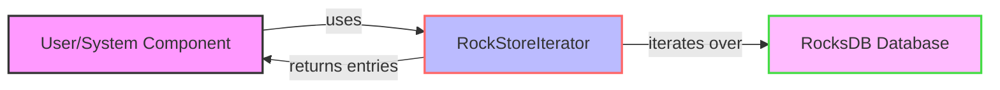

## Module: RockStoreIterator.java
根据提供的代码模块，以下是以中文进行的综合分析：

- **模块名称**：RockStoreIterator.java
- **主要目标**：此模块的目的是提供一种遍历RocksDB键值对的迭代器实现。
- **关键功能**：
  - `close()`：关闭迭代器以释放资源。
  - `hasNext()`：检查是否还有更多的元素。
  - `next()`：返回下一个键值对。
  - `seek(byte[] key)`：移动到指定的键。
  - `seekToFirst()`：移动到第一个键。
  - `seekToLast()`：移动到最后一个键。
  - `valid()`：检查当前位置是否有效。
  - `getKey()`：获取当前键。
  - `getValue()`：获取当前值。
  - `checkState()`：检查迭代器的状态，确保未关闭。
- **关键变量**：
  - `dbIterator`：RocksIterator实例，用于实际的遍历操作。
  - `first`：布尔值，用于标记是否为第一次遍历。
  - `close`：AtomicBoolean实例，用于标记迭代器是否已关闭。
- **相互依赖性**：此模块依赖于RocksDB的`RocksIterator`类来进行底层的遍历操作。
- **核心与辅助操作**：核心操作包括遍历和获取键值对（`next()`, `seek()`, `seekToFirst()`, `seekToLast()`），辅助操作包括状态检查（`checkState()`）和关闭迭代器（`close()`）。
- **操作序列**：通常，使用此迭代器的流程是先通过`seekToFirst()`、`seekToLast()`或`seek(byte[] key)`定位，然后通过`hasNext()`和`next()`遍历键值对。
- **性能方面**：性能考虑包括避免重复打开和关闭迭代器以及在遍历时有效地管理资源。
- **可重用性**：此迭代器设计为可重用于不同的RocksDB实例，只要它们遵循相同的数据结构和操作模式。
- **使用**：用于在RocksDB中遍历键值对，可以用于数据检索、数据迁移等场景。
- **假设**：假设底层的RocksDB数据库已经正确配置和初始化，且迭代器的使用者会正确地管理迭代器的打开和关闭。

这个分析提供了对`RockStoreIterator.java`模块的深入理解，包括其设计目的、主要功能、以及如何在实际应用中使用它。
## Flow Diagram [via mermaid]

