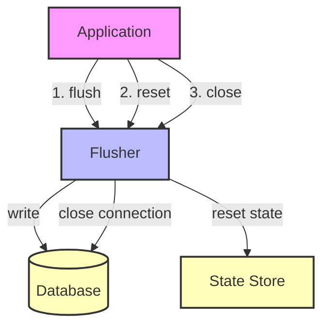

## Module: Flusher.java
由于原始请求中没有提供具体的代码实现，以下分析基于提供的接口定义进行。

- **模块名称**：Flusher.java

- **主要目标**：该模块的目的是定义一个接口，用于管理数据的刷新（flush）操作，以确保数据的持久化。这通常涉及将内存中的数据批量写入数据库或文件系统。

- **关键功能**：
  - `flush(Map<WrappedByteArray, WrappedByteArray> batch)`: 这个方法负责将传入的数据批量（batch）持久化。这是接口的核心功能，支持数据的批量处理。
  - `close()`: 此方法用于关闭与资源的连接，例如关闭数据库连接或文件流，确保所有的资源都被适当释放。
  - `reset()`: 该方法用于重置内部状态，使得接口实现可以重新开始其操作，而不受之前操作的影响。

- **关键变量**：由于这是一个接口定义，直接的变量定义不在此处，但关键的数据结构是传递给`flush`方法的`Map<WrappedByteArray, WrappedByteArray>`，它代表了要持久化的数据批量。

- **互依性**：该接口可能与实现数据存储和检索的其他系统组件有互动，比如数据库管理系统或文件系统。实现此接口的类需要与这些组件协作，以完成数据的持久化工作。

- **核心与辅助操作**：`flush`方法是核心操作，因为它直接关系到数据持久化的主要功能。`close`和`reset`可以视为辅助操作，它们帮助管理资源和状态，但不直接涉及数据处理的核心逻辑。

- **操作序列**：在一般使用场景中，首先会通过`flush`方法多次提交数据批量进行持久化，然后在所有数据都处理完毕后，使用`close`方法关闭资源。`reset`方法的使用取决于具体实现和使用场景。

- **性能方面**：在实现此接口时，性能是一个重要考虑因素。批量处理数据可以减少I/O操作的次数，从而提高性能。同时，实现需要考虑如何有效管理内存和资源，避免性能瓶颈。

- **可重用性**：该接口的设计抽象了数据持久化的基本操作，使得不同的持久化机制能够通过实现此接口来集成。这增加了代码的可重用性和灵活性。

- **使用**：实现此接口的类可以被用于任何需要批量数据持久化的场景，比如在区块链管理、大数据处理或任何需要高效数据写入的应用中。

- **假设**：在设计此接口时，可能做出的假设包括：数据批量大小是合理的，即不会导致内存溢出；持久化操作的底层实现（如数据库或文件系统）是可靠的；以及调用`close`方法之前，所有的数据批量都已通过`flush`方法处理。

这个分析基于接口定义进行，具体实现的细节可能会根据实现方式和使用场景有所不同。
## Flow Diagram [via mermaid]

