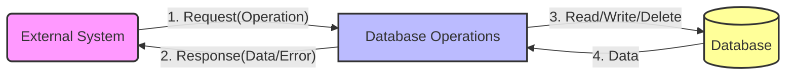

## Module: IRevokingDB.java
### 模块名称
- IRevokingDB.java

### 主要目标
- 定义一个接口，管理键值对的存储、检索、删除等操作，主要用于区块链数据的版本控制和状态回退。

### 关键功能
- `put(byte[] key, byte[] newValue)`: 存储键值对。
- `delete(byte[] key)`: 删除指定键的数据。
- `has(byte[] key)`: 检查是否含有指定的键。
- `get(byte[] key)`: 根据键获取值，如果找不到则抛出`ItemNotFoundException`。
- `getFromRoot(byte[] key)`: 从根节点获取数据，如果找不到则抛出`ItemNotFoundException`。
- `getUnchecked(byte[] key)`: 根据键获取值，不检查是否存在。
- `close()`: 关闭数据库连接。
- `reset()`: 重置数据库状态。
- `setCursor(Chainbase.Cursor cursor)`, `setCursor(Chainbase.Cursor cursor, long offset)`, `getCursor()`: 管理数据库游标。
- `getlatestValues(long limit)`, `getValuesNext(byte[] key, long limit)`, `getKeysNext(byte[] key, long limit)`, `prefixQuery(byte[] key)`: 支持基于区块存储的高级查询。

### 关键变量
- 由于这是一个接口，直接定义的变量较少，主要关注参数和返回类型，如`byte[] key`, `byte[] newValue`, `Chainbase.Cursor cursor`等。

### 互相依赖
- 与`Chainbase`类有显著的互相依赖，特别是在游标操作和异常处理上。

### 核心与辅助操作
- 核心操作：键值对的存储、检索和删除。
- 辅助操作：游标管理、状态重置和关闭数据库。

### 操作序列
- 操作序列不是静态定义的，而是由使用该接口的具体实现类和上下文决定。

### 性能方面
- 性能考虑可能包括数据存储和检索的效率，以及如何有效管理内存和处理大量的键值对。

### 可重用性
- 作为一个接口，`IRevokingDB`设计用于被多个组件实现和重用，以支持不同的数据存储需求和场景。

### 使用
- 通常被区块链核心模块实现，用于管理区块链状态的存储、版本控制和数据回退。

### 假设
- 假设存在一个有效的底层数据存储机制。
- 假设调用者理解如何正确使用游标和处理`ItemNotFoundException`异常。

通过这个分析，我们可以看出`IRevokingDB`是设计用来支持区块链数据管理的复杂操作，特别是在需要数据版本控制和回退功能的场景中。
## Flow Diagram [via mermaid]

