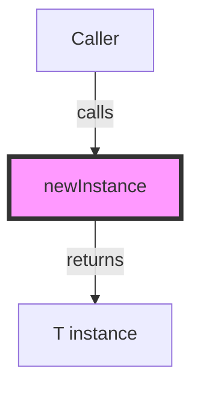

## Module: Instance.java
**模块名称**：Instance.java

**主要目标**：该模块的目的是定义一个接口，用于创建泛型类型T的新实例。这是一个典型的工厂模式接口，旨在为不同类型的对象提供一个统一的创建接口。

**关键功能**：
- `newInstance()`：这是该接口的主要方法，负责创建并返回一个泛型类型T的新实例。该方法没有参数，强调了无需特定信息即可创建对象的能力。

**关键变量**：由于这是一个接口，因此没有直接的变量。但是，泛型类型T是一个关键的“变量”，因为它决定了`newInstance()`方法将返回的对象类型。

**相互依赖性**：该模块作为一个接口，其实现依赖于具体类来定义如何创建特定类型的实例。因此，它与实现了该接口的任何类或组件有相互依赖关系。

**核心与辅助操作**：在这个接口中，`newInstance()`方法是唯一的核心操作，因为它是接口唯一定义的功能。没有明确的辅助操作，除非实现类中定义了额外的功能。

**操作序列**：作为一个接口，`Instance.java`本身并不定义操作序列。操作序列将由实现了`Instance`接口的类来确定。

**性能方面**：性能考虑通常与接口的实现相关，而不是接口本身。实现`newInstance()`方法时，应考虑对象创建的效率和资源消耗。

**可重用性**：该接口高度可重用，因为它提供了一个非常通用的对象创建机制。通过泛型，它可以用于任何类型的对象创建，使得在不同上下文中重用成为可能。

**使用**：`Instance`接口可以在需要统一对象创建模式的任何地方使用。实现该接口允许开发者定义如何实例化特定类型的对象，这在许多设计模式（如工厂模式、抽象工厂模式）中非常有用。

**假设**：
- 假设实现该接口的类将正确实现`newInstance()`方法，即能够创建并返回正确类型的对象实例。
- 假设使用该接口的开发者或系统了解如何正确地实现和使用该接口，以及泛型类型T的使用方式。

这个分析概述了`Instance.java`模块的关键方面，包括其目的、功能、以及如何在系统中使用和实现。
## Flow Diagram [via mermaid]

