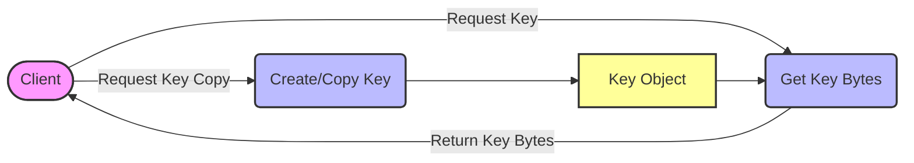

## Module: Key.java
- **模块名称**：Key.java

- **主要目标**：该模块的目的是提供一个用于表示键的不可变类，主要用于数据库操作中，以确保键的一致性和安全性。

- **关键函数**：
  - `copyOf(byte[] bytes)`：接受一个字节数组，返回一个包含相同字节的新`Key`对象。此方法确保传入的字节数组在内部被复制，从而保持不可变性。
  - `of(byte[] bytes)`：接受一个字节数组，返回一个新的`Key`对象，与`copyOf`方法类似，但可能在内部处理上有所不同。
  - `getBytes()`：返回一个新的字节数组，该数组是内部数据的副本，以确保外部代码不能修改内部状态。

- **关键变量**：
  - `WrappedByteArray data`：一个私有变量，保存键的实际数据。使用`WrappedByteArray`是为了进一步封装字节数组，增强数据处理的安全性和灵活性。

- **相互依赖性**：该模块依赖于`WrappedByteArray`类来处理字节数据的封装和不可变性，但具体的`WrappedByteArray`实现细节并未在此代码片段中给出。

- **核心与辅助操作**：
  - 核心操作：`copyOf`、`of`和`getBytes`方法是该类的核心，它们支持创建和检索键的基本功能。
  - 辅助操作：类定义中包括了`@EqualsAndHashCode`注解，这是Lombok库的一部分，用于自动生成`equals`和`hashCode`方法，虽非直接操作，但对于确保键对象在集合中正确处理非常重要。

- **操作顺序**：通常，使用此类的流程首先涉及通过`copyOf`或`of`方法创建`Key`对象，然后可以多次调用`getBytes`方法以根据需要检索键的数据。

- **性能方面**：考虑到每次调用`getBytes`都会创建字节数组的副本，可能会对性能有一定影响，特别是在高频调用场景下。因此，应当谨慎管理对此方法的调用。

- **可重用性**：该类通过提供一种标准方式来创建和管理键，具有很高的可重用性，可以在需要处理键的不可变性和一致性的多种场景中使用。

- **使用情况**：此类主要用于数据库操作中，作为键的表示，确保键的处理在整个应用程序中是一致且安全的。

- **假设**：代码假设传入的字节数组不会在外部修改。尽管`Key`类内部保证了不可变性，但如果字节数组在传入`copyOf`或`of`方法之前被外部修改，仍然可能导致不可预期的结果。
## Flow Diagram [via mermaid]

