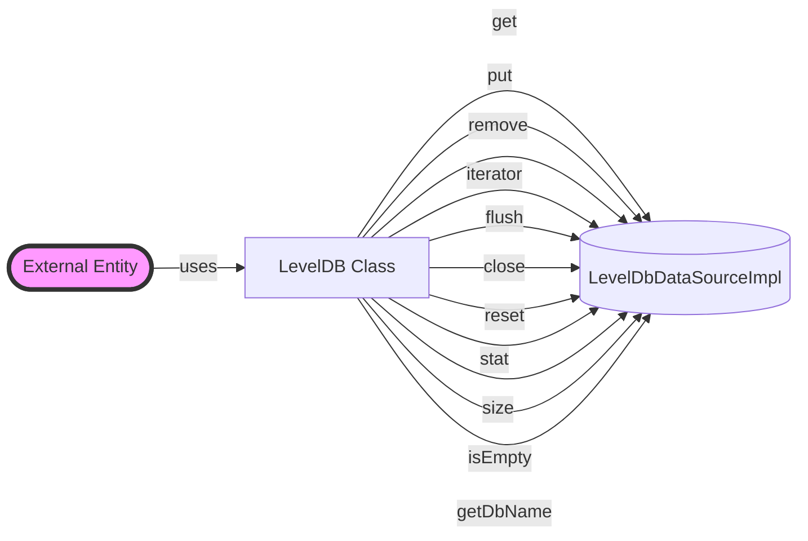

## Module: LevelDB.java
- **模块名称**：LevelDB.java

- **主要目的**：该模块的目的是为了提供对LevelDB键值存储数据库的基本操作接口，包括数据的读取、写入、删除、迭代等功能。

- **关键功能**：
  - `get(byte[] key)`：根据键获取值。
  - `put(byte[] key, byte[] value)`：存储键值对。
  - `remove(byte[] key)`：根据键删除数据。
  - `iterator()`：获取数据库的迭代器，用于遍历数据库。
  - `flush(Map<WrappedByteArray, WrappedByteArray> batch)`：批量更新数据库。
  - `close()`：关闭数据库连接。
  - `reset()`：重置数据库。
  - `newInstance()`：创建LevelDB的新实例。
  - `stat()`：获取数据库的统计信息。

- **关键变量**：
  - `db`：LevelDbDataSourceImpl类型，是操作LevelDB的核心对象。
  - `writeOptions`：写入操作的配置选项。

- **相互依赖性**：该模块依赖于`LevelDbDataSourceImpl`类来实现具体的数据库操作，并使用`WriteOptionsWrapper`来配置写入操作。

- **核心与辅助操作**：核心操作包括数据的增删改查（`get`、`put`、`remove`、`flush`），辅助操作包括数据库的打开、关闭、重置以及状态统计（`close`、`reset`、`stat`）。

- **操作序列**：通常操作序列开始于打开数据库（通过构造函数），随后执行增删改查等操作，最后关闭数据库（`close`）。

- **性能方面**：性能考虑包括写入操作的同步/异步配置（通过`writeOptions`），以及批量更新操作（`flush`）以提高效率。

- **可重用性**：通过`newInstance()`方法可以创建数据库的新实例，增强了模块的可重用性。

- **使用**：该模块被用于需要持久化存储键值对数据的场景，特别是在区块链技术栈中，用于存储区块链的状态、交易等信息。

- **假设**：假设外部环境已经正确配置了LevelDB数据库环境，且`CommonParameter.getInstance().getStorage().isDbSync()`能够正确返回数据库同步/异步写入的配置。
## Flow Diagram [via mermaid]

