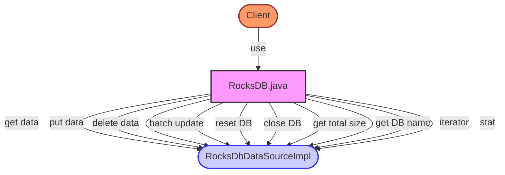

## Module: RocksDB.java
- **模块名称**: RocksDB

- **主要目标**: 该模块的目的是为了提供一个基于RocksDbDataSourceImpl的数据库操作接口，用于数据的存取、删除、批量更新等操作。

- **关键函数**:
  - `get(byte[] key)`: 根据键获取值。
  - `put(byte[] key, byte[] value)`: 存储键值对。
  - `remove(byte[] key)`: 根据键删除数据。
  - `flush(Map<WrappedByteArray, WrappedByteArray> batch)`: 批量更新数据。
  - `close()`: 关闭数据库连接。
  - `reset()`: 重置数据库。
  - `newInstance()`: 创建新的RocksDB实例。
  - `stat()`: 获取数据库的统计信息。

- **关键变量**:
  - `db`: RocksDbDataSourceImpl类型，是操作数据库的主要接口。
  - `optionsWrapper`: WriteOptionsWrapper类型，用于配置写入数据库时的选项。

- **相互依赖性**: 此模块依赖于`RocksDbDataSourceImpl`进行数据库操作，同时也依赖于`CommonParameter`和`WriteOptionsWrapper`进行配置。

- **核心 vs. 辅助操作**:
  - 核心操作包括数据的增、删、查。
  - 辅助操作包括数据库的打开、关闭、重置以及批量更新。

- **操作序列**: 一般情况下，使用该模块时，首先需要创建一个RocksDB实例，然后通过该实例进行数据的增删查等操作。在操作完成后，可以调用`close()`方法关闭数据库连接。

- **性能方面**: 在进行批量数据更新时，通过`flush`方法可以提高性能。同时，通过配置`WriteOptionsWrapper`可以优化写入性能。

- **可重用性**: 该模块通过提供`newInstance()`方法支持创建新的实例，增加了其可重用性。

- **使用情况**: 该模块可用于需要持久化存储键值对数据的场景，特别是在区块链等技术领域中，用于存储交易数据、账户信息等。

- **假设**: 在使用该模块时，假设外部环境已经正确配置了RocksDB数据库环境，且`CommonParameter`中的配置项已经正确设置。
## Flow Diagram [via mermaid]

