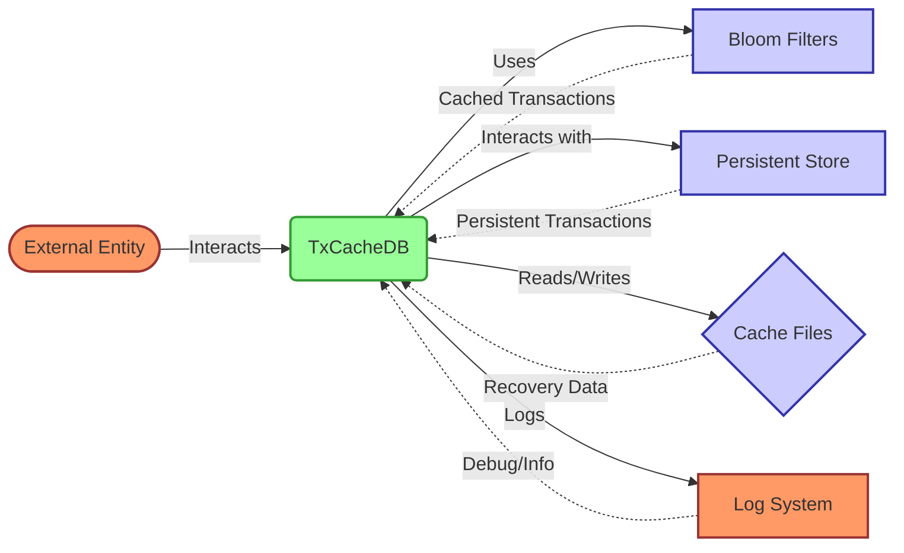

## Module: TxCacheDB.java
根据提供的代码模块，以下是以中文进行的综合分析：

- **模块名称**：TxCacheDB.java

- **主要目标**：该模块旨在提供一个高效的方式来缓存和查询最近的交易信息，以优化交易查询性能和提高系统的响应速度。

- **关键功能**：
  - `initCache()`：初始化缓存，将持久化存储中的数据加载到布隆过滤器中。
  - `init()`：初始化方法，负责启动时的数据恢复和缓存加载。
  - `get(byte[] key)`：通过键查询交易是否存在。
  - `put(byte[] key, byte[] value)`：向缓存中添加交易信息。
  - `flush(Map<WrappedByteArray, WrappedByteArray> batch)`：批量更新缓存。
  - `close()`：关闭缓存，进行数据持久化。
  - `recovery()`：数据恢复方法，用于从文件中恢复布隆过滤器的状态。

- **关键变量**：
  - `bloomFilters`：一个包含两个布隆过滤器的数组，用于记录最近的交易信息。
  - `filterStartBlock`：记录当前活动过滤器的起始区块号。
  - `currentFilterIndex`：记录当前活跃的布隆过滤器索引。
  - `TRANSACTION_COUNT`：估计每个区块中的交易数。
  - `FAKE_TRANSACTION`：代表交易存在的伪交易记录。

- **依赖关系**：
  - 与`RecentTransactionStore`和`DynamicPropertiesStore`有直接的依赖关系，用于加载和存储交易信息。
  - 依赖于Google的Guava库中的布隆过滤器实现。
  - 依赖于LevelDB或RocksDB作为持久化存储。

- **核心与辅助操作**：
  - 核心操作包括交易信息的查询(`get`)和添加(`put`)。
  - 辅助操作包括缓存的初始化(`init`)、恢复(`recovery`)和持久化(`dump`)。

- **操作顺序**：
  - 启动时首先进行数据恢复(`recovery`)，然后加载最近的交易信息到布隆过滤器，之后对外提供查询和添加交易信息的服务。

- **性能考虑**：
  - 使用布隆过滤器来优化查询性能，减少对持久化存储的访问。
  - 通过维护两个布隆过滤器并定期更换来避免过滤器的过度膨胀。

- **可重用性**：
  - 该模块设计为可重用的组件，可以在需要缓存交易信息的场景中使用。

- **使用**：
  - 作为交易信息缓存的一部分，被区块链系统中的其他组件调用，以提高交易查询的效率。

- **假设**：
  - 假设每个区块中的交易数量是已知的，这个值用于初始化布隆过滤器的容量。
  - 假设系统的存储配置是正确的，包括数据库引擎的选择等。

这个分析提供了一个关于`TxCacheDB.java`模块功能和设计的全面视角，涵盖了其目标、关键功能、变量、依赖关系以及其他重要方面。
## Flow Diagram [via mermaid]

