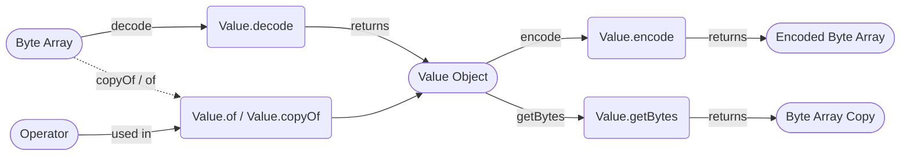

## Module: Value.java
- **模块名称**: Value.java

- **主要目标**: 该模块的目的是为了封装数据库操作中的值对象，包括操作类型和数据内容，以便于数据库的增删改查操作。

- **关键函数**:
  - `decode(byte[] bytes)`: 根据字节数组解码得到Value对象。
  - `copyOf(Operator operator, byte[] data)`: 根据操作类型和数据内容复制得到一个新的Value对象。
  - `of(Operator operator, byte[] data)`: 根据操作类型和数据内容创建一个新的Value对象。
  - `encode()`: 将Value对象编码为字节数组。
  - `getBytes()`: 获取数据内容的字节数组。

- **关键变量**:
  - `operator`: 操作类型，是一个枚举，表示创建、修改、删除或者是放置操作。
  - `data`: 封装的字节数组，表示操作的数据内容。

- **依赖关系**: 这个类主要与数据库操作相关的其他组件交互，如数据库的增删改查方法可能会使用到这个类来封装或解析数据。

- **核心与辅助操作**: 核心操作包括Value对象的创建、编码和解码。辅助操作可能包括获取操作类型和数据内容的方法。

- **操作序列**: 通常，首先会通过`of`或`copyOf`方法创建Value对象，然后在数据库操作中使用该对象。在需要网络传输或存储时，可能会调用`encode`方法将对象编码为字节数组，相应地，在接收端会通过`decode`方法解码得到Value对象。

- **性能方面**: 在编码和解码过程中，需要注意性能开销，特别是当数据内容较大时。此外，使用枚举和封装的字节数组可能会引入一定的性能开销。

- **可重用性**: 这个类设计得具有较好的通用性和可重用性，可以在不同的数据库操作场景中使用。

- **使用方式**: 主要用于数据库操作中数据的封装和解析，通过封装操作类型和数据内容，简化数据库操作的实现。

- **假设**: 假设所有的操作类型都可以通过一个字节来表示，且数据内容可以为空或者是任意长度的字节数组。
## Flow Diagram [via mermaid]

