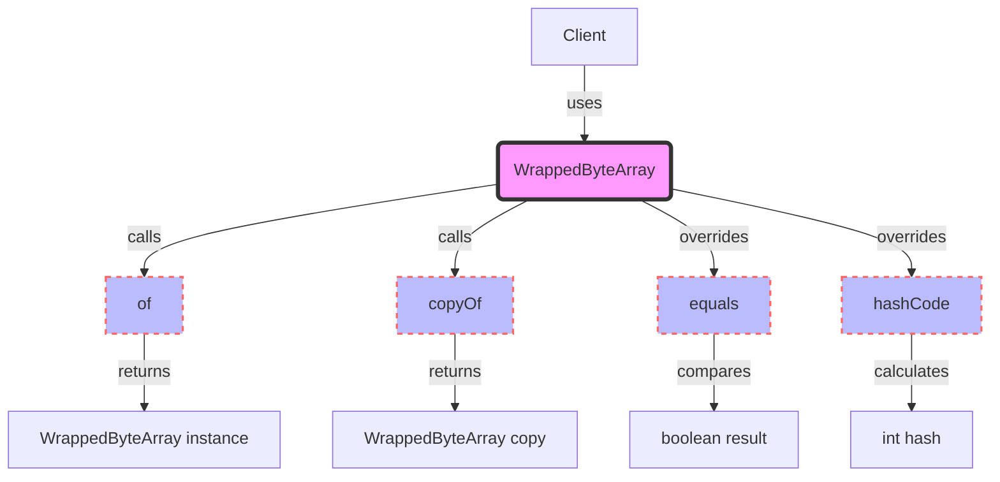

## Module: WrappedByteArray.java
### 模块名称
WrappedByteArray.java

### 主要目标
该模块的主要目的是提供一个封装了字节数组的类，以便在需要比较、复制或获取字节数组的哈希码时，能够更加方便地操作。

### 关键功能
- **of(byte[] bytes)**: 接收一个字节数组，返回一个WrappedByteArray实例。
- **copyOf(byte[] bytes)**: 接收一个字节数组，复制该数组，并返回一个包含复制数组的WrappedByteArray实例。
- **equals(Object o)**: 重写equals方法，用于比较两个WrappedByteArray实例是否相等。
- **hashCode()**: 重写hashCode方法，返回字节数组的哈希码。

### 关键变量
- **private byte[] bytes**: 存储字节数组的变量。

### 交互依赖
此模块主要独立工作，但它可以与需要字节数组比较、复制或哈希操作的任何其他系统组件交互。

### 核心与辅助操作
- **核心操作**: `equals`和`hashCode`方法是该类的核心操作，因为它们覆盖了Java Object类的基本方法，确保了WrappedByteArray实例可以正确地用于比较和散列集合中。
- **辅助操作**: `of`和`copyOf`方法是辅助操作，它们提供了创建WrappedByteArray实例的便利方式。

### 操作序列
1. 使用`of`或`copyOf`方法创建WrappedByteArray实例。
2. 使用`equals`方法比较WrappedByteArray实例。
3. 使用`hashCode`方法获取WrappedByteArray实例的哈希码。

### 性能考虑
- `copyOf`方法在复制大字节数组时可能会影响性能，因为它需要分配新的内存并复制数组。
- `equals`和`hashCode`方法的性能取决于字节数组的大小，因为它们需要遍历数组进行比较或计算哈希码。

### 可重用性
WrappedByteArray类设计得具有高度的可重用性，可以在任何需要封装字节数组以进行比较、复制或哈希操作的场景中使用。

### 使用
WrappedByteArray可以用于数据库操作、网络通信或任何需要对字节数组进行封装操作的场景。

### 假设
- 假设传入的字节数组不会在外部被修改，以确保WrappedByteArray实例的不可变性。
- 假设使用者了解在处理大字节数组时可能对性能的影响。
## Flow Diagram [via mermaid]

