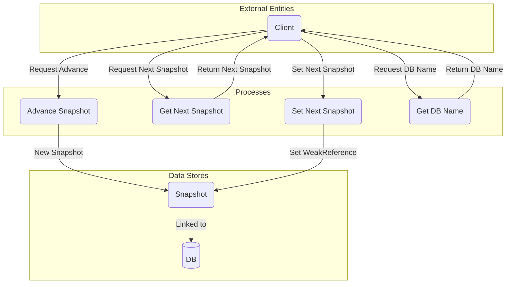

## Module: AbstractSnapshot.java
- **模块名称**：AbstractSnapshot.java

- **主要目标**：此模块的目的是为数据库快照提供一个抽象基类，用于管理和维护数据库状态的历史版本，以便可以高效地回滚或访问旧数据。

- **关键功能**：
  - `advance()`：创建并返回一个新的快照实例，用于前进到快照链中的下一个状态。
  - `getNext()`：获取链中的下一个快照（如果存在）。
  - `setNext(Snapshot next)`：设置链中的下一个快照。
  - `getDbName()`：返回数据库的名称。
  - `isOptimized()`：指示快照是否已经过优化。

- **关键变量**：
  - `db`：存储当前快照所基于的数据库实例。
  - `previous`：指向前一个快照的引用。
  - `next`：指向下一个快照的弱引用。
  - `isOptimized`：标记快照是否经过优化处理。

- **相互依赖性**：此模块与系统中的其他组件（如数据库实现`DB<K, V>`）紧密相连，依赖于数据库的状态和操作来管理快照。

- **核心与辅助操作**：
  - 核心操作包括快照的创建（`advance()`），获取下一个快照（`getNext()`），以及快照优化状态的查询（`isOptimized()`）。
  - 辅助操作包括设置下一个快照（`setNext()`）和获取数据库名称（`getDbName()`）。

- **操作序列**：操作序列通常开始于创建一个新快照（通过`advance()`），然后可能涉及查询下一个快照（`getNext()`），设置下一个快照（`setNext()`），并根据需要查询数据库名称和优化状态。

- **性能方面**：性能考虑包括如何有效地管理快照链，以及如何通过优化减少内存使用和提高数据访问速度。

- **可重用性**：作为一个抽象类，`AbstractSnapshot`为不同类型的数据库快照提供了一个基础框架，可以通过继承和实现其方法来适应不同的数据库和存储需求。

- **使用**：在需要管理数据库状态历史版本的场景中使用，比如在区块链、版本控制系统或任何需要快照功能的应用中。

- **假设**：
  - 假设存在一个底层的数据库实现`DB<K, V>`，能够支持基本的数据操作。
  - 假设系统中存在一种机制来有效地处理和维护快照链，尽管具体实现细节可能因应用而异。
## Flow Diagram [via mermaid]

