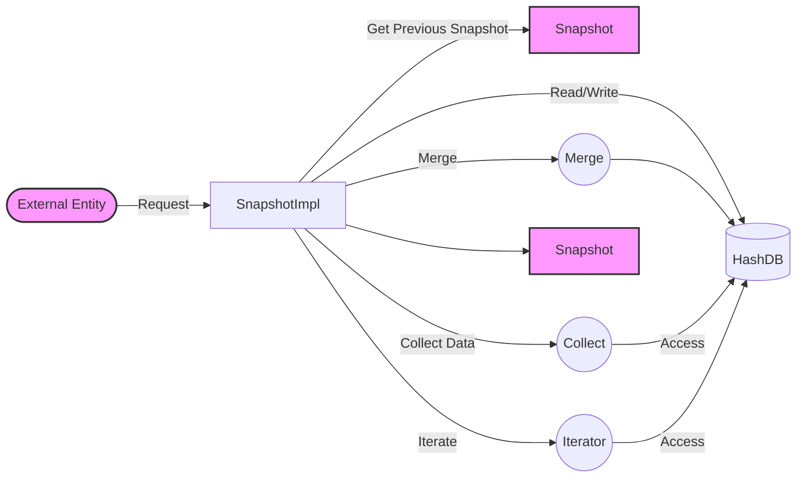

## Module: SnapshotImpl.java
**模块名称**：SnapshotImpl.java

**主要目标**：该模块的目的是提供一种机制来处理和维护区块链状态的快照。它允许对状态的修改、回退和合并，以便于区块链的状态管理。

**关键功能**：
- `get(byte[] key)`：根据给定的键获取值。
- `put(byte[] key, byte[] value)`：将键值对存储到快照中。
- `remove(byte[] key)`：从快照中移除指定的键。
- `merge(Snapshot from)`：将另一个快照的更改合并到当前快照中。
- `retreat()`：回退到前一个快照状态。
- `getSolidity()`：获取稳定状态的快照。
- `iterator()`：提供遍历快照中所有键值对的迭代器。
- `close()`：关闭快照，释放资源。
- `reset()`、`resetSolidity()`、`updateSolidity()`：重置和更新快照的稳定性状态。

**关键变量**：
- `root`：根快照，所有操作的基准点。
- `db`：存储键值对的数据库。
- `previous`：指向前一个快照的引用，用于实现回退功能。

**互相依赖**：该模块依赖于`HashDB`、`Key`、`Value`等类来实现其功能，与系统中的其他组件（如状态管理和区块链操作）紧密相连。

**核心与辅助操作**：
- 核心操作包括键值对的存储、删除、获取，以及快照的合并和回退。
- 辅助操作包括快照的创建、稳定性状态的更新和资源的释放。

**操作序列**：通常，操作序列开始于创建快照实例，随后是键值对的添加或删除，可能会有合并其他快照的需求，最终可能需要回退到之前的状态或更新稳定性状态。

**性能方面**：性能考虑包括快照操作的效率，特别是在合并和回退操作中，需要优化以减少资源消耗和提高响应速度。

**可重用性**：该模块设计有良好的封装性和独立性，使其可以在不同的场景下重用，尤其是在需要区块链状态管理的应用中。

**使用**：主要用于区块链系统中管理状态的快照，包括状态的保存、恢复和更新，以支持区块链操作的正确性和一致性。

**假设**：
- 假设所有的键和值在使用前都已经过校验，不包含空值。
- 假设合并操作中，当前快照的更改优先级高于被合并的快照。
- 假设系统中的其他组件能够正确维护快照之间的关系，确保操作的一致性和正确性。
## Flow Diagram [via mermaid]

