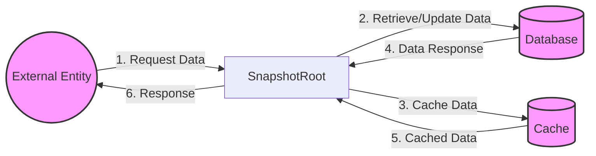

## Module: SnapshotRoot.java
基于提供的代码模块，以下是以中文进行的综合分析：

- **模块名称**：SnapshotRoot.java

- **主要目标**：该模块的目的是提供一个快照根，用于管理和优化数据库操作，特别是针对账户数据库的操作和缓存管理。

- **关键功能**：
  - `get(byte[] key)`：获取给定键的值，首先尝试从缓存中获取，如果未命中，则从数据库获取并更新缓存。
  - `put(byte[] key, byte[] value)`：将键值对存入数据库，并更新缓存。如果需要，还会进行资产优化处理。
  - `remove(byte[] key)`：从数据库中删除给定的键，并更新缓存。
  - `merge(Snapshot from)` 和 `merge(List<Snapshot> snapshots)`：合并来自其他快照的数据，处理账户批量操作，并更新缓存。
  - `processAccount(Map<WrappedByteArray, WrappedByteArray> batch)`：处理账户数据，优化资产存储。

- **关键变量**：
  - `private Snapshot solidity`：当前快照的固态版本。
  - `private boolean isAccountDB`：标识当前数据库是否为账户数据库。
  - `private TronCache<WrappedByteArray, WrappedByteArray> cache`：用于存储键值对的缓存。

- **相互依赖性**：该模块与多个系统组件有交互，包括`ChainBaseManager`（用于访问动态属性和账户资产存储）、`AccountAssetStore`（管理账户资产）、`DB`接口（底层数据库操作）和`CacheManager`（缓存管理）。

- **核心与辅助操作**：
  - 核心操作包括数据的获取、存储、删除和合并，这些是直接与数据库交互的操作。
  - 辅助操作包括缓存管理和资产优化处理，这些提高了操作效率，但不直接涉及数据持久化。

- **操作顺序**：操作通常遵循从缓存查询、更新缓存到数据库操作的顺序，以优化性能和减少对底层数据库的直接访问。

- **性能方面**：通过使用缓存和资产优化，该模块旨在提高数据库操作的效率，减少不必要的数据库访问和存储空间使用。

- **可重用性**：该模块设计为可重用的，可以用于不同的数据库和缓存场景，尤其是在需要优化账户资产存储的应用中。

- **使用**：该模块主要用于`org.tron.core.db2.core`包内的数据库操作，特别是与账户数据和资产管理相关的操作。

- **假设**：
  - 假设底层数据库提供必要的接口和性能要求。
  - 假设缓存管理能够有效地处理缓存的分配和释放。
  - 假设系统配置（如`CommonParameter`）正确设置，以支持缓存和资产优化功能。

通过上述分析，我们可以看出，`SnapshotRoot`模块是一个关键的组件，用于优化数据库操作和管理缓存，特别是在处理账户数据和资产优化方面。
## Flow Diagram [via mermaid]

