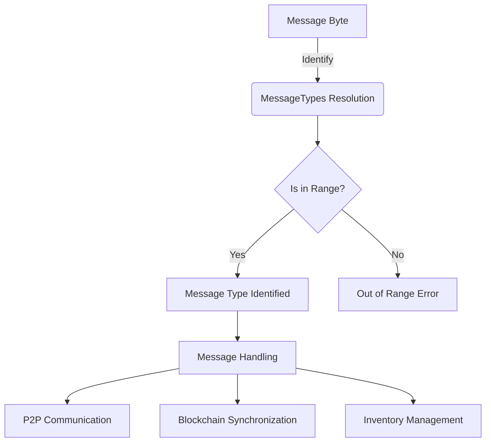

## Module: MessageTypes.java
**模块名称**：MessageTypes.java

**主要目标**：定义和管理网络消息类型的枚举，用于区分不同类型的网络通信消息。

**关键功能**：
- `fromByte(byte i)`：通过字节值查找对应的消息类型。
- `inRange(byte code)`：检查给定的代码是否在有效消息类型范围内。
- `inP2pRange(byte code)`：检查代码是否属于P2P消息范围。
- `inTronRange(byte code)`：检查代码是否属于Tron消息范围。
- `asByte()`：将消息类型转换为对应的字节表示。
- `inPbftRange(byte code)`：检查代码是否属于PBFT消息范围。
- `toString()`：根据消息类型的不同，返回不同的字符串表示。

**关键变量**：
- `private final int type`：存储消息类型的整数值。
- `private static final Map<Integer, MessageTypes> intToTypeMap`：存储整数值到消息类型枚举的映射。

**相互依赖性**：此模块与系统中处理网络消息的其他组件密切相关，用于消息的识别、分类和处理。

**核心与辅助操作**：
- 核心操作包括消息类型的定义、消息类型与字节值之间的转换。
- 辅助操作包括范围检查函数，用于确定消息类型是否属于特定的消息范围。

**操作序列**：通常，网络组件会首先使用`fromByte`方法根据接收到的消息字节值确定消息类型，然后根据消息类型进行相应的处理。

**性能方面**：考虑到性能，通过使用静态映射`intToTypeMap`来快速查找消息类型，避免了使用大量的if-else语句或switch-case语句。

**可重用性**：此枚举模块设计为可重用，可以轻松地在需要处理不同网络消息类型的任何地方使用。

**使用**：在网络通信中，根据接收到的消息字节值使用此模块来识别消息类型，然后进行相应的处理，如数据同步、区块链信息交换等。

**假设**：
- 假设所有消息类型都已经被正确定义且不会频繁变动。
- 假设消息类型的范围划分是合理的，能够覆盖所有需要的网络通信场景。
## Flow Diagram [via mermaid]

