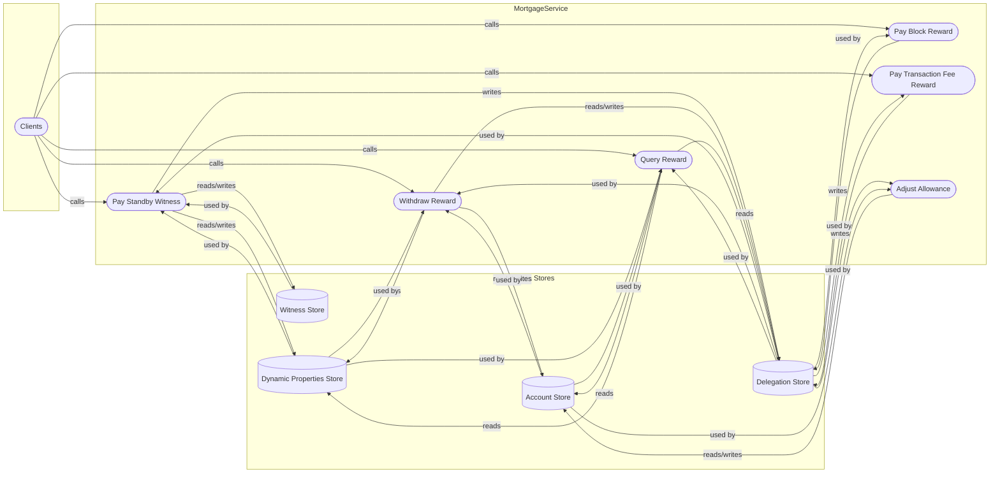

## Module: MortgageService.java
- **模块名称**: MortgageService.java

- **主要目的**: 此模块的主要目的是处理与抵押服务相关的各种操作，包括支付见证人奖励、计算奖励、调整账户余额等。

- **关键函数**:
  - `initStore`: 初始化存储服务。
  - `payStandbyWitness`: 支付备选见证人的奖励。
  - `payBlockReward`: 支付区块奖励。
  - `payTransactionFeeReward`: 支付交易费奖励。
  - `withdrawReward`: 提取奖励。
  - `queryReward`: 查询奖励。
  - `adjustAllowance`: 调整账户余额。

- **关键变量**:
  - `WitnessStore witnessStore`: 用于见证人信息的存储。
  - `DelegationStore delegationStore`: 用于委托信息的存储。
  - `DynamicPropertiesStore dynamicPropertiesStore`: 用于动态属性的存储。
  - `AccountStore accountStore`: 用于账户信息的存储。

- **相互依赖性**: 该模块依赖于`WitnessStore`、`DelegationStore`、`DynamicPropertiesStore`和`AccountStore`等其他组件，以实现其功能。

- **核心 vs. 辅助操作**:
  - 核心操作包括奖励支付、奖励计算和奖励提取。
  - 辅助操作包括存储服务的初始化和账户余额的调整。

- **操作顺序**: 通常，先初始化存储服务，然后根据需要执行奖励支付、奖励提取或查询等操作。

- **性能方面**: 在支付奖励和计算奖励时，需要考虑性能，尤其是在处理大量数据时。

- **可重用性**: 此模块的设计允许它在不同的上下文中重用，特别是在需要处理抵押和奖励相关操作的任何区块链系统中。

- **使用**: 该模块在系统中用于管理和执行与抵押相关的各种奖励操作，如见证人奖励的支付和提取。

- **假设**:
  - 系统已经有了一个有效的见证人和委托人的列表。
  - 相关的存储服务已经被正确初始化并且可以使用。
## Flow Diagram [via mermaid]

