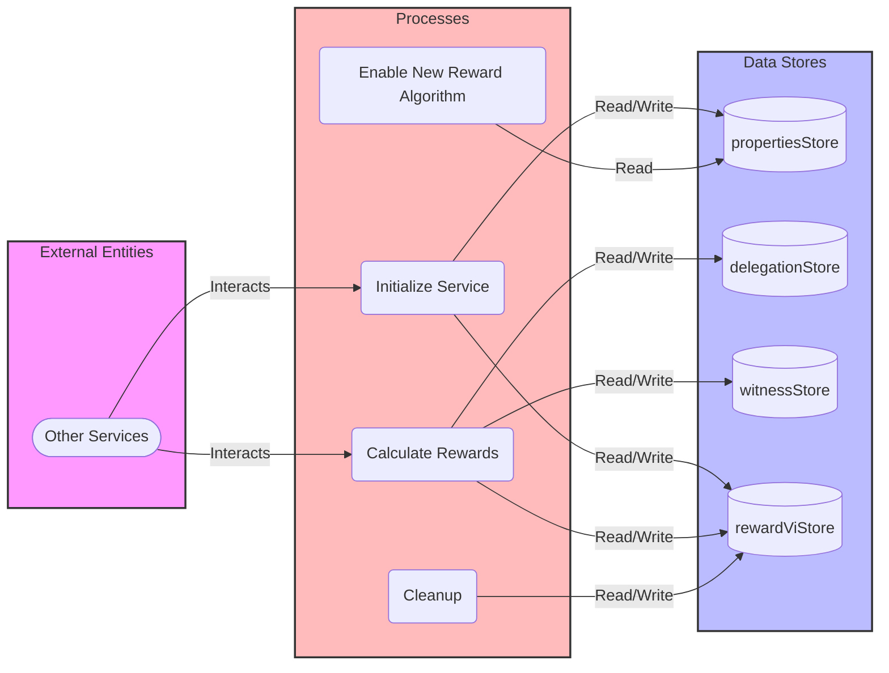

## Module: RewardViCalService.java
根据提供的代码模块，以下是用中文进行的综合分析：

- **模块名称**：RewardViCalService.java

- **主要目标**：该模块的目的是计算和分配区块链网络中见证人的奖励。

- **关键功能**：
  - `init()`：初始化方法，用于启动定时任务。
  - `maybeRun()`：根据条件判断是否执行奖励计算。
  - `startRewardCal()`：开始计算奖励。
  - `accumulateWitnessReward()`：累计见证人奖励。
  - `getNewRewardAlgorithmReward()`：获取新奖励算法下的奖励。
  - `calcMerkleRoot()`：计算Merkle根，用于验证奖励数据的一致性。

- **关键变量**：
  - `newRewardCalStartCycle`：新奖励计算开始周期。
  - `lastBlockNumber`：最后一个区块号。
  - `rewardViRoot`：奖励的Merkle根。
  - `IS_DONE_KEY`和`IS_DONE_VALUE`：用于标记奖励计算是否完成。

- **互相依赖**：该模块与`DynamicPropertiesStore`、`DelegationStore`、`WitnessStore`和`RewardViStore`等数据库操作类有互相依赖关系，用于存取区块链网络的动态配置、委托信息、见证人信息和奖励信息。

- **核心与辅助操作**：
  - 核心操作包括奖励计算（`startRewardCal`）和Merkle根计算（`calcMerkleRoot`）。
  - 辅助操作包括初始化（`init`）和条件判断（`maybeRun`）。

- **操作顺序**：首先通过`init`方法在启动时初始化，然后定期执行`maybeRun`方法来判断是否满足执行条件，如果满足，则执行`startRewardCal`开始计算奖励，最后计算Merkle根以验证数据一致性。

- **性能方面**：代码中使用了定时任务和锁（`CountDownLatch`）来控制计算的执行，这可能会对性能产生一定影响，尤其是在数据量大时。优化并发处理和数据库访问可能有助于提高性能。

- **可重用性**：该模块的设计专注于特定的业务逻辑（即奖励计算），但其中的一些方法和概念（如Merkle根计算）可以在其他上下文中重用。

- **使用**：该模块被设计为自动执行，通过定时任务周期性检查并执行奖励计算，无需手动干预。

- **假设**：代码假设了新奖励算法的生效周期可以通过`propertiesStore`获取，且存在一个明确的周期在哪奖励计算需要开始。还假设了所有需要的数据都可以通过与数据库的交互获得。

这个分析基于代码提供的信息，没有考虑到代码外的上下文信息。
## Flow Diagram [via mermaid]

