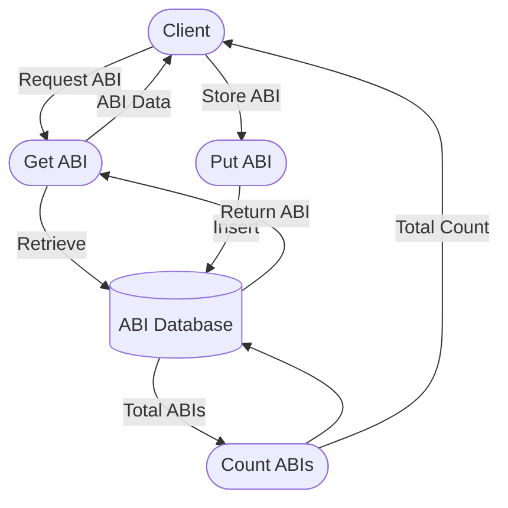

## Module: AbiStore.java
- **模块名称**: AbiStore.java

- **主要目标**: 该模块的目的是为了管理和存储智能合约的ABI（Application Binary Interface，应用程序二进制接口）。它允许系统检索和更新智能合约的ABI信息，从而支持智能合约的执行和交互。

- **关键功能**:
  - `get(byte[] key)`: 根据给定的键（智能合约的地址）检索对应的ABI信息。
  - `put(byte[] key, byte[] value)`: 存储或更新给定键（智能合约的地址）对应的ABI信息。
  - `getTotalABIs()`: 返回当前存储的所有ABI信息的数量。

- **关键变量**:
  - `dbName`: 数据库名称，用于区分存储ABI信息的特定数据库。
  
- **交互依赖**:
  - `TronStoreWithRevoking`: AbiStore继承自TronStoreWithRevoking，后者提供了撤销机制和数据库操作的基本方法。这意味着AbiStore可以利用这些基础设施来执行其操作。

- **核心与辅助操作**:
  - 核心操作包括`get`, `put`, 和 `getTotalABIs`，这些是与ABI信息直接交互的方法。
  - 辅助操作可能包括与数据库连接和管理相关的操作，这些是由其父类`TronStoreWithRevoking`提供支持的。

- **操作序列**:
  - 用户或系统首先通过`put`方法存储ABI信息。
  - 通过`get`方法可以检索存储的ABI信息。
  - 可以通过`getTotalABIs`方法查询存储的ABI信息总量。

- **性能方面**:
  - 性能考量可能包括数据库操作的效率，如ABI信息的检索和更新速度。
  - 使用`Streams.stream(revokingDB.iterator()).count();`来计算ABI数量可能影响性能，特别是当数据量很大时。

- **可重用性**:
  - 该模块设计为可重用的组件，可以在需要管理智能合约ABI信息的任何地方使用。

- **使用**:
  - 该模块被用于Tron区块链框架中，以支持智能合约的部署和交互。

- **假设**:
  - 假设所有的智能合约ABI信息都可以通过其合约地址唯一标识。
  - 假设数据库操作的效率足够高，不会成为系统性能的瓶颈。
## Flow Diagram [via mermaid]

