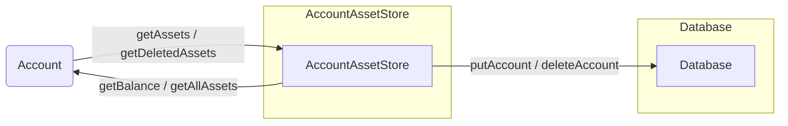

## Module: AccountAssetStore.java
- **模块名称**: AccountAssetStore.java

- **主要目标**: 此模块的目的是管理和存储账户资产信息，包括资产的增加、删除和查询等操作。

- **关键功能**:
  - `put(byte[] key, byte[] item)`: 将账户资产数据存储到数据库中。
  - `delete(byte[] key)`: 从数据库中删除指定的账户资产数据。
  - `get(byte[] key)`: 根据键值从数据库中获取账户资产数据。
  - `has(byte[] key)`: 检查数据库中是否存在指定键值的账户资产数据。
  - `putAccount(Protocol.Account account)`: 存储账户的资产信息。
  - `deleteAccount(byte[] key)`: 删除指定账户的所有资产信息。
  - `getAssets(Protocol.Account account)`: 获取账户的所有资产信息。
  - `getDeletedAssets(byte[] key)`: 获取指定账户已删除的资产信息。
  - `convert(Map<WrappedByteArray, WrappedByteArray> map)`: 将WrappedByteArray映射转换为byte数组映射。
  - `getBalance(Protocol.Account account, byte[] key)`: 获取账户指定资产的余额。
  - `getAllAssets(Protocol.Account account)`: 获取账户的所有资产及其余额。

- **关键变量**:
  - `dbSource`: 数据库源，用于实际的数据存取操作。
  - `assets`: 存储资产信息的映射。

- **相互依赖性**: 此模块依赖于TronDatabase类进行数据库操作，同时使用了Protocol.Account类来处理账户信息。

- **核心与辅助操作**:
  - 核心操作：资产的存储、删除和查询。
  - 辅助操作：转换资产数据格式、获取账户的资产余额等。

- **操作序列**: 通常先检查账户或资产是否存在，然后进行相应的增加、删除或查询操作。

- **性能方面**: 性能考虑包括确保数据存取的效率和准确性，以及优化数据库查询以减少延迟。

- **可重用性**: 此模块设计为可重用的，可以在不同的项目中管理账户资产信息，只需少量修改即可适应不同的需求。

- **使用**: 在需要管理用户资产信息的系统中使用，如加密货币钱包或交易平台。

- **假设**: 假设所有的账户资产数据都是有效的，并且数据库操作都能正确执行。
## Flow Diagram [via mermaid]

