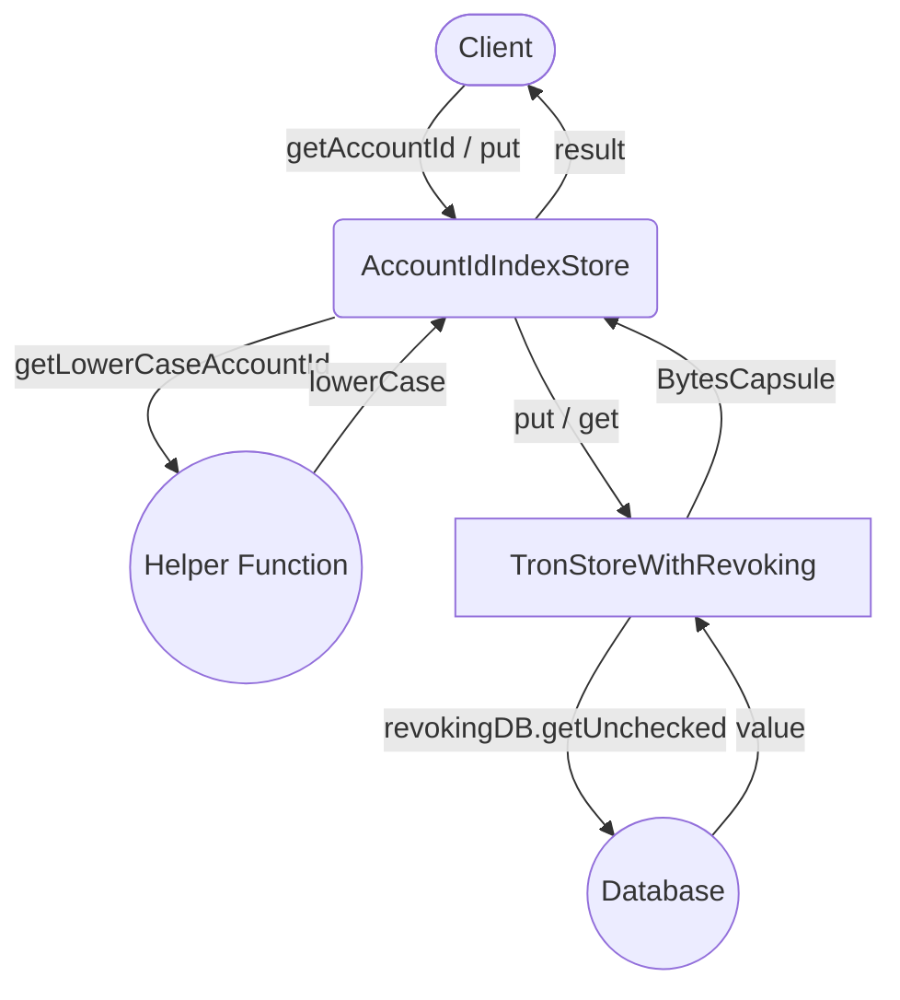

## Module: AccountIdIndexStore.java
- **模块名称**：AccountIdIndexStore.java

- **主要目标**：此模块的目的是为了管理和索引账户ID与账户地址之间的映射关系，以支持基于账户ID的查询操作。

- **关键函数**：
  - `put(AccountCapsule accountCapsule)`：将账户ID（转换为小写）与账户地址的映射关系存储起来。
  - `get(ByteString name)`和`get(byte[] key)`：根据账户ID（小写）获取对应的账户地址。
  - `has(byte[] key)`：检查是否存在给定账户ID（小写）对应的账户地址。

- **关键变量**：
  - `dbName`：数据库名称，通过构造函数注入。
  
- **相互依赖性**：此模块依赖于`TronStoreWithRevoking`类提供的基础存储功能，以及`BytesCapsule`类用于封装账户地址数据。

- **核心与辅助操作**：
  - 核心操作包括账户ID与账户地址的存储（`put`方法）和查询（`get`方法）。
  - 辅助操作包括账户ID的小写转换和对存储操作的封装。

- **操作顺序**：首先，通过`put`方法存储账户ID与地址的映射关系；然后，可以通过`get`方法根据账户ID查询对应的账户地址。

- **性能方面**：性能考虑包括对账户ID进行小写转换以规范化键值，以及使用`revokingDB.getUnchecked`方法直接从底层数据库获取数据，旨在优化查询效率。

- **可重用性**：此模块设计为通用的账户ID索引存储机制，可以适用于不同的场景下管理账户ID与地址的映射关系。

- **使用**：在需要根据账户ID查询账户地址或管理账户ID与地址映射关系的场景下使用此模块。

- **假设**：
  - 假设所有的账户ID在存储前都会被转换为小写，以保证查询时的一致性。
  - 假设调用此模块的上层逻辑已经处理好所有必要的数据验证和格式化工作。
## Flow Diagram [via mermaid]

