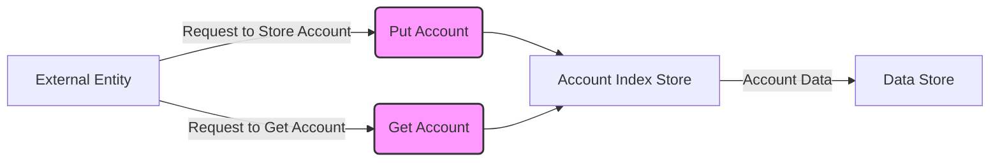

## Module: AccountIndexStore.java
根据提供的代码模块，以下是以中文进行的综合分析：

- **模块名称**：AccountIndexStore.java

- **主要目标**：该模块的目的是为了管理账户索引，使得可以通过账户名称快速检索到账户地址。

- **关键功能**：
  - `put(AccountCapsule accountCapsule)`：将账户名称和账户地址存储起来，其中账户名称作为键，账户地址作为值。
  - `get(ByteString name)`：通过账户名称检索账户地址。
  - `get(byte[] key)`：重写的方法，通过键（这里指账户名称的字节数组）来获取值（账户地址的字节数组封装）。
  - `has(byte[] key)`：检查是否存在给定键（账户名称）的记录。

- **关键变量**：
  - 无直接的关键变量定义在代码段中，但可以推断`dbName`是关键的初始化参数，指定了数据库名称。

- **互依赖性**：
  - 该模块依赖于`TronStoreWithRevoking`，这是一个提供了撤销功能的数据库访问层。
  - 依赖于`AccountCapsule`和`BytesCapsule`类来封装账户信息和字节数据。
  - 使用`revokingDB`进行数据存取，这表明它与数据库操作紧密相关。

- **核心与辅助操作**：
  - 核心操作包括`put`和`get`方法，它们直接支持账户索引的存储和检索。
  - 辅助操作包括`has`方法，用于检查某个键是否存在。

- **操作序列**：
  - 先通过`put`方法存储账户名称和地址的映射。
  - 通过`get`方法使用账户名称检索账户地址。
  - 可以使用`has`方法检查特定账户名称是否已经存储。

- **性能方面**：
  - 性能考虑可能包括数据库访问的效率和存储结构的优化，以快速检索和存储数据。

- **可重用性**：
  - 该模块设计为组件（@Component），意味着它可以在Spring框架中作为单独的组件被重用和注入。

- **使用**：
  - 该模块用于在区块链平台（如Tron）中管理账户索引，允许通过账户名称快速访问账户地址。

- **假设**：
  - 假设所有账户名称都是唯一的，这样才能确保`put`和`get`方法的准确性。
  - 假设使用者了解如何处理可能返回的`null`值，尤其是在`get`方法中。

这个分析基于代码的结构和功能进行了简要的概述，具体实现细节和性能优化可能需要更深入的代码审查和测试。
## Flow Diagram [via mermaid]

