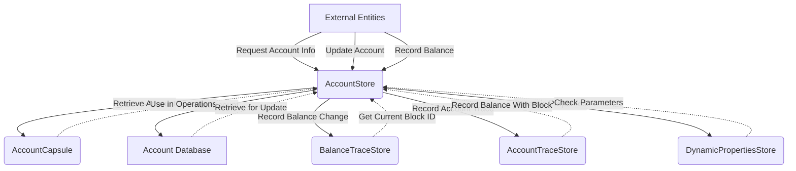

## Module: AccountStore.java
**模块名称**：AccountStore.java

**主要目标**：此模块的目的是管理和存储账户信息，包括账户的创建、更新、删除以及查询等操作。

**关键功能**：
- `setAccount`：初始化账户信息，根据配置文件中的初始区块资产信息设置账户地址。
- `get`：通过账户的地址获取账户的信息。
- `put`：更新或添加账户信息到存储中。
- `delete`：删除指定账户的信息。
- `getSun`、`getBlackhole`、`getZion`：分别获取特定预设账户的信息。

**关键变量**：
- `assertsAddress`：一个静态HashMap，用于存储预设账户名称和地址的映射关系。

**相互依赖性**：
- 与`AccountStateCallBackUtils`、`BalanceTraceStore`、`AccountTraceStore`、`DynamicPropertiesStore`等其他系统组件有交互，这些组件协助完成账户状态的回调、余额追踪、账户追踪以及动态属性的存储等功能。

**核心与辅助操作**：
- 核心操作包括账户信息的增删改查。
- 辅助操作包括记录余额变动、处理历史余额查找等。

**操作序列**：
- 在添加或更新账户信息时，会根据是否启用历史余额查找功能来决定是否记录账户的余额变动。
- 删除账户信息时，同样会考虑是否记录余额变动。

**性能方面**：
- 性能考虑包括如何高效地存取账户信息，以及如何优化历史余额查找和余额变动记录的处理。

**可重用性**：
- 该模块设计为可重用，可以在不同的项目中管理账户信息，只需适当配置即可。

**使用**：
- 在区块链系统中，用于管理和存储账户信息，是系统正常运行的基础组件之一。

**假设**：
- 假设所有进入该模块的账户地址都是有效的。
- 假设系统配置正确，能够正确初始化预设账户信息。

通过上述分析，我们可以看出`AccountStore.java`模块是一个关键的组件，它负责处理账户信息的存储和管理，是区块链系统中不可或缺的一部分。
## Flow Diagram [via mermaid]

