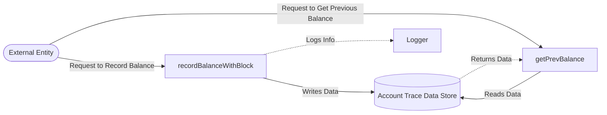

## Module: AccountTraceStore.java
基于提供的代码模块，以下是以中文进行的综合分析：

- **模块名称**：AccountTraceStore.java

- **主要目的**：该模块的目的是为了存储和追踪账户余额的变化。

- **关键功能**：
  - `recordBalanceWithBlock(byte[] address, long number, long balance)`：记录特定区块高度下账户的余额。
  - `getPrevBalance(byte[] address, long number)`：获取给定地址和区块号的前一个余额记录。

- **关键变量**：
  - `dbName`：数据库名称，用于初始化存储。
  
- **相互依赖性**：该模块依赖于`TronStoreWithRevoking`类来实现撤销功能，并使用`AccountTraceCapsule`封装账户余额信息。

- **核心与辅助操作**：
  - 核心操作包括记录和检索账户余额。
  - 辅助操作可能包括日志记录和错误处理。

- **操作序列**：首先，通过`recordBalanceWithBlock`方法记录账户在特定区块的余额。然后，可以使用`getPrevBalance`方法查询之前的余额记录。

- **性能方面**：在性能方面，该模块需要高效地处理大量的数据读写操作，特别是在区块链网络中频繁地更新和查询账户余额时。

- **可重用性**：该模块设计为可重用，可以在需要跟踪账户余额变化的其他区块链项目中使用。

- **使用方式**：在区块链系统中，每当区块被确认并需要更新账户余额时，就会调用`recordBalanceWithBlock`方法。查询账户历史余额时，会使用`getPrevBalance`方法。

- **假设**：
  - 假设所有传入的地址和区块号都是有效的。
  - 假设在调用`getPrevBalance`方法时，如果没有找到之前的余额记录，则返回余额为0。

这个模块为Tron区块链或类似的系统提供了一个重要的功能，即追踪和记录账户余额的变化，这对于保持网络的财务透明性和用户信任至关重要。
## Flow Diagram [via mermaid]

