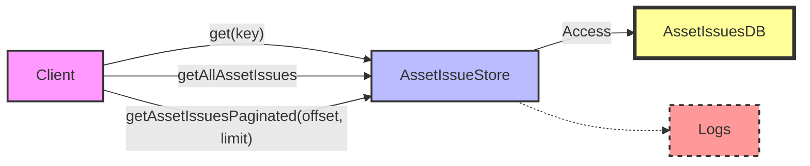

## Module: AssetIssueStore.java
- **模块名称**：AssetIssueStore.java

- **主要目标**：该模块的目的是管理和存储资产发行信息，提供对资产发行数据的基本操作，如获取、分页查询等。

- **关键函数**：
  - `get(byte[] key)`：根据给定的键（资产名称）获取资产发行信息。
  - `getAllAssetIssues()`：获取所有资产发行信息的列表。
  - `getAssetIssuesPaginated(List<AssetIssueCapsule> assetIssueList, long offset, long limit)`：从给定的资产发行列表中，根据偏移量和限制获取分页的资产发行信息。
  - `getAssetIssuesPaginated(long offset, long limit)`：获取分页的资产发行信息，这是对上一个方法的封装，直接使用所有资产发行数据进行分页。

- **关键变量**：
  - `ASSET_ISSUE_COUNT_LIMIT_MAX`：定义了分页查询中允许的最大记录数限制。

- **相互依赖性**：该模块依赖于`TronStoreWithRevoking`类来实现数据的存储和撤销操作，同时使用`AssetIssueCapsule`类来封装资产发行信息。

- **核心与辅助操作**：
  - 核心操作包括资产发行信息的获取和分页查询。
  - 辅助操作可能包括日志记录、错误处理等。

- **操作序列**：典型的使用序列可能是首先调用`getAllAssetIssues()`获取所有资产发行信息，然后根据需要调用`getAssetIssuesPaginated()`进行分页查询。

- **性能方面**：在处理大量资产发行信息时，分页查询的性能尤其重要，需要有效地管理内存和查询效率，以防止性能瓶颈。

- **可重用性**：该模块通过提供标准的资产发行信息操作接口，可以在需要管理资产发行信息的其他组件中重用。

- **使用**：该模块主要被用于需要资产发行信息管理的场景中，如在区块链平台中管理不同资产的发行和分配。

- **假设**：
  - 假设资产发行信息已经按照一定的格式和规则存储。
  - 假设调用分页查询方法时提供的偏移量和限制参数是合理的，即不会导致查询超出实际数据范围。
## Flow Diagram [via mermaid]

