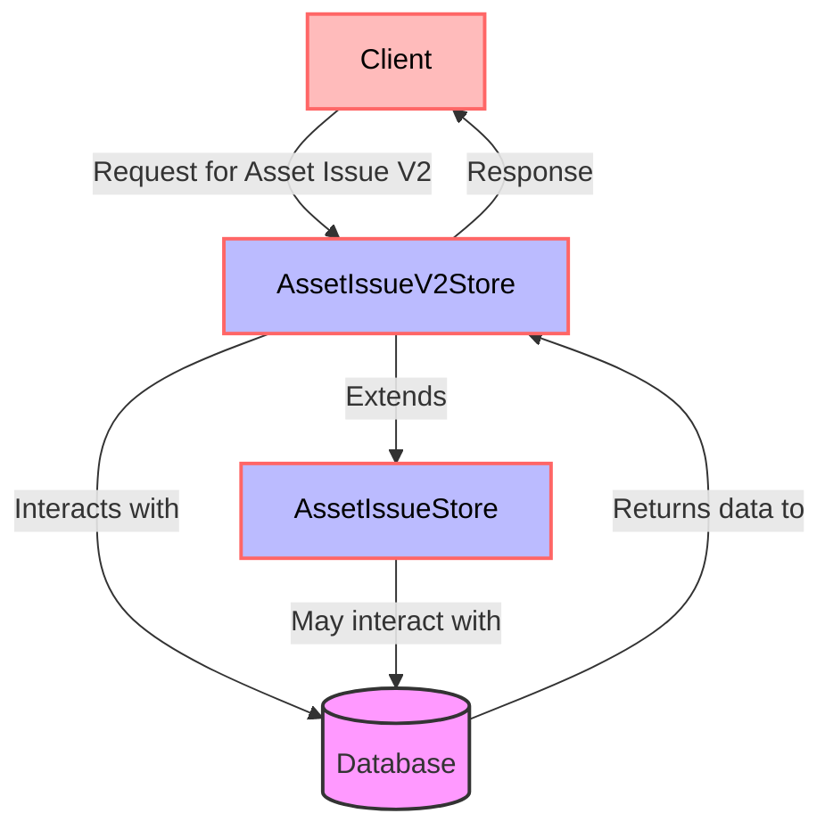

## Module: AssetIssueV2Store.java
- **模块名称**：AssetIssueV2Store.java

- **主要目标**：此模块的目的是提供一种机制来存储和管理资产发行的版本2信息，这是在特定数据库中操作资产发行数据的一个扩展。

- **关键功能**：
  - 构造函数：通过指定数据库名称（`asset-issue-v2`），初始化父类`AssetIssueStore`的实例，用于处理资产发行相关的数据操作。

- **关键变量**：
  - `dbName`：数据库名称，用于指定此存储操作的目标数据库。
  
- **相互依赖性**：
  - 继承自`AssetIssueStore`：该模块通过继承`AssetIssueStore`类，复用了父类提供的资产发行数据操作的方法和逻辑。
  - 与Spring框架的依赖：通过使用`@Autowired`和`@Value`注解，模块依赖于Spring框架来注入数据库名称，并实现依赖注入的功能。

- **核心与辅助操作**：
  - 核心操作：继承并可能扩展`AssetIssueStore`中定义的资产发行相关的数据操作方法。
  - 辅助操作：通过Spring框架的依赖注入功能来配置数据库名称。

- **操作序列**：在Spring框架的上下文中创建对象时，首先通过构造函数注入数据库名称，然后利用父类`AssetIssueStore`的功能来执行具体的数据操作。

- **性能方面**：性能考虑可能包括数据库操作的效率，如何优化数据访问速度，以及如何处理大量的资产发行数据。

- **可重用性**：由于此模块是在`AssetIssueStore`基础上进行扩展的，它继承了父类的方法并可能添加新的功能，因此具有一定的可重用性，特别是在处理资产发行版本2数据时。

- **使用**：此模块用于操作和管理数据库中的资产发行版本2信息，可以在需要处理与资产发行相关的数据操作时使用。

- **假设**：
  - 假设数据库已经正确配置，并且`asset-issue-v2`数据库可用。
  - 假设调用此模块的方法前，已经通过Spring框架完成了必要的依赖注入。
## Flow Diagram [via mermaid]

