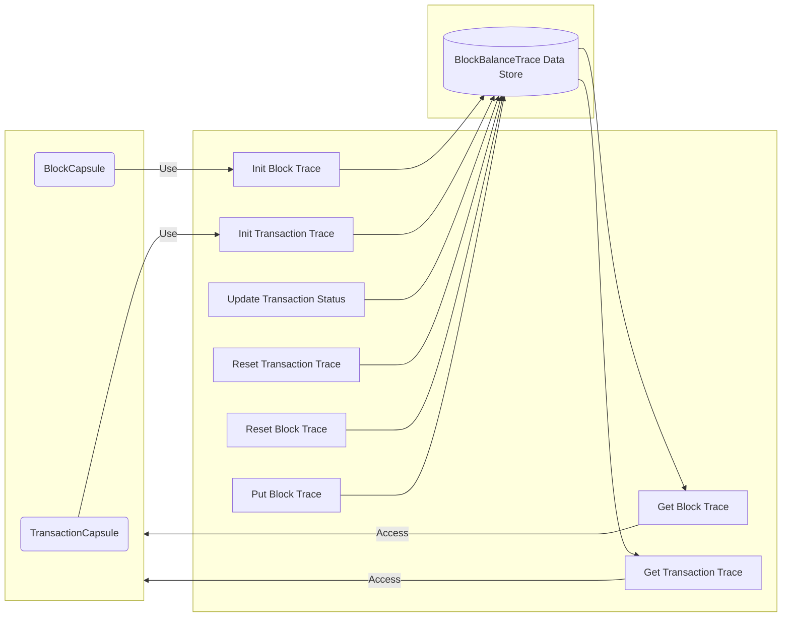

## Module: BalanceTraceStore.java
- **模块名称**: BalanceTraceStore.java

- **主要目标**: 该模块的目的是为了管理和存储区块和交易的余额跟踪信息，以支持历史余额查询功能。

- **关键功能**:
  - `setCurrentTransactionId(TransactionCapsule transactionCapsule)`: 设置当前交易ID。
  - `setCurrentBlockId(BlockCapsule blockCapsule)`: 设置当前区块ID。
  - `resetCurrentTransactionTrace()`: 重置当前交易跟踪信息。
  - `resetCurrentBlockTrace()`: 重置当前区块跟踪信息。
  - `initCurrentBlockBalanceTrace(BlockCapsule blockCapsule)`: 初始化当前区块的余额跟踪信息。
  - `initCurrentTransactionBalanceTrace(TransactionCapsule transactionCapsule)`: 初始化当前交易的余额跟踪信息。
  - `updateCurrentTransactionStatus(String status)`: 更新当前交易的状态。
  - `getBlockBalanceTrace(BlockCapsule.BlockId blockId)`: 根据区块ID获取区块的余额跟踪信息。
  - `getTransactionBalanceTrace(BlockCapsule.BlockId blockId, Sha256Hash transactionId)`: 根据区块ID和交易ID获取交易的余额跟踪信息。

- **关键变量**:
  - `currentBlockId`: 当前处理的区块ID。
  - `currentTransactionId`: 当前处理的交易ID。
  - `currentBlockBalanceTraceCapsule`: 当前区块的余额跟踪信息。
  - `currentTransactionBalanceTrace`: 当前交易的余额跟踪信息。

- **相互依赖性**: 该模块依赖于`TronStoreWithRevoking`进行数据存储的基础操作，同时也与`BlockCapsule`和`TransactionCapsule`等模块交互，用于获取区块和交易的相关信息。

- **核心与辅助操作**: 核心操作包括初始化和更新区块以及交易的余额跟踪信息，辅助操作包括设置当前区块ID和交易ID等。

- **操作序列**: 首先通过`initCurrentBlockBalanceTrace`和`initCurrentTransactionBalanceTrace`初始化余额跟踪信息，然后在交易处理过程中通过`updateCurrentTransactionStatus`更新交易状态，最后通过`resetCurrentTransactionTrace`和`resetCurrentBlockTrace`重置跟踪信息。

- **性能方面**: 在处理大量交易和区块时，该模块需要高效地更新和查询余额跟踪信息，性能优化是一个考虑因素。

- **可重用性**: 该模块设计为可重用组件，可以在需要历史余额查询功能的其他项目或模块中使用。

- **使用**: 该模块主要被区块链的核心系统使用，用于跟踪和管理区块和交易的余额变化。

- **假设**: 假设所有传入的区块和交易数据都是有效和完整的，且系统配置已启用历史余额查询功能。
## Flow Diagram [via mermaid]

